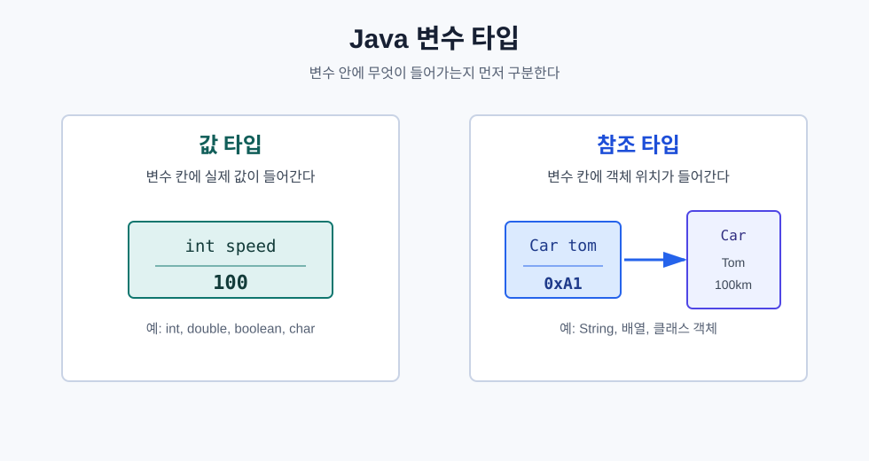
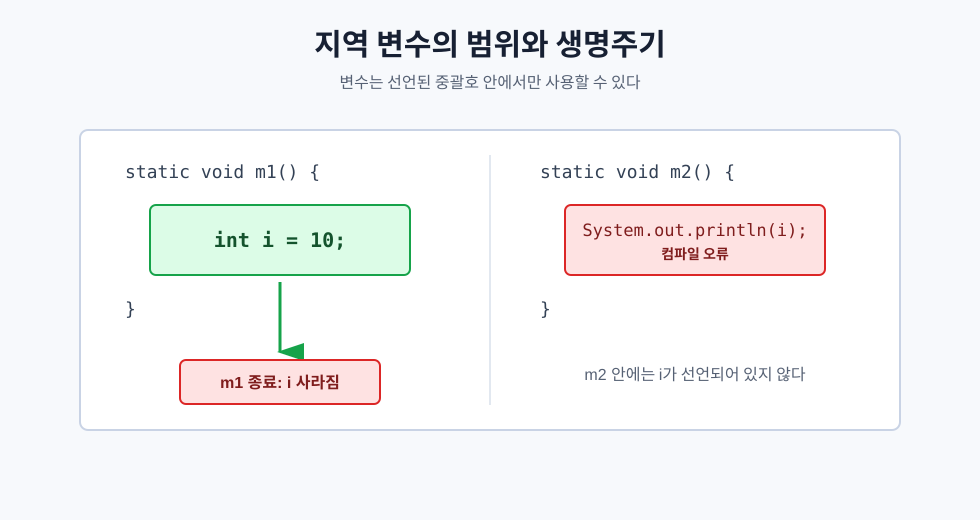
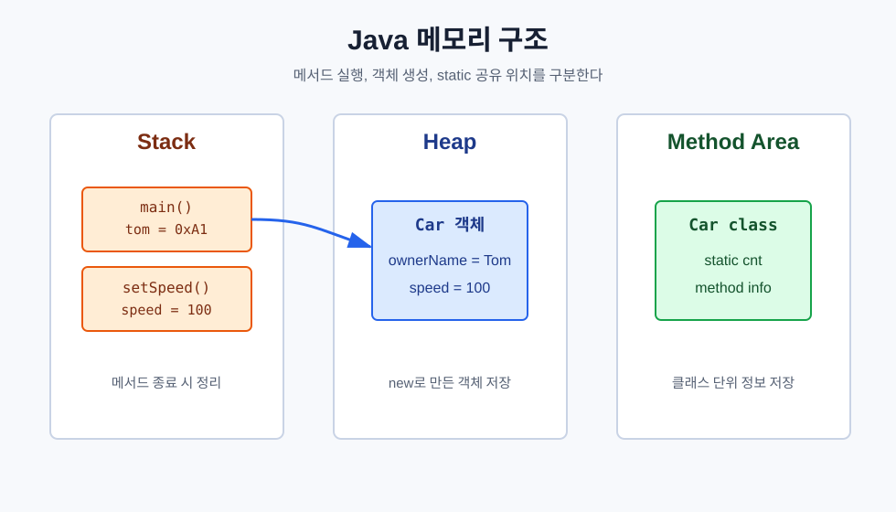
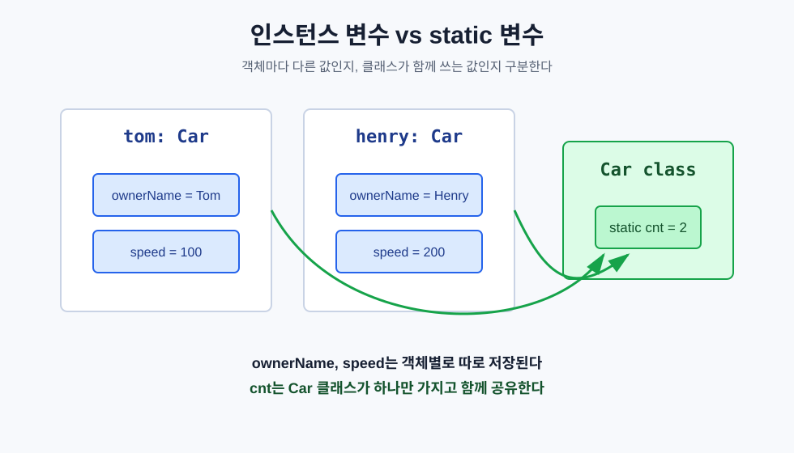
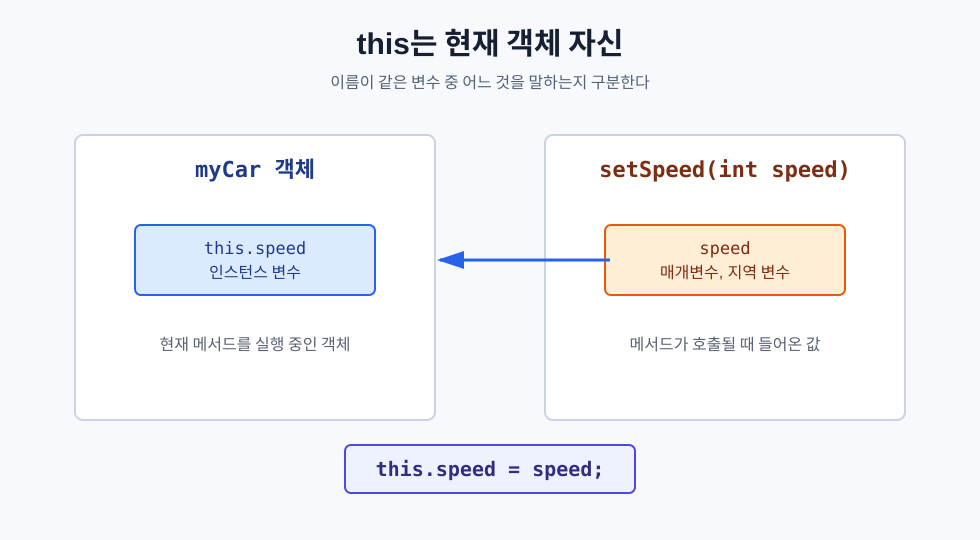

# Day 1. Java 클래스, 변수, 메모리 구조

> 목표: Java에서 변수가 어디에 저장되고, 객체가 어떻게 만들어지며, `static`과 `this`가 왜 필요한지 이해한다.

## 오늘 배운 것 한눈에 보기



오늘의 핵심은 **변수는 저장되는 값의 종류와 선언 위치에 따라 역할이 달라진다**는 것이다.

| 구분 | 핵심 의미 | 예시 |
| --- | --- | --- |
| 기본형 | 변수 안에 실제 값이 들어간다. 값 타입이라고 이해해도 된다. | `int speed = 100;` |
| 참조 타입 | 변수 안에 객체의 위치, 즉 주소가 들어간다. | `Car myCar = new Car();` |
| 지역 변수 | 메서드 안에서 잠깐 쓰는 변수다. 직접 초기화해야 한다. | `int i = 10;` |
| 인스턴스 변수 | 객체마다 따로 가지는 변수다. | `ownerName`, `speed` |
| static 변수 | 클래스가 공용으로 하나만 가지는 변수다. | `Car.cnt`, `Robot.cnt` |

## 1. 기본형과 참조 타입

기본형은 변수 칸에 값 자체가 들어간다. 수업이나 정리에서는 "값 타입"처럼 이해해도 되지만, Java 공식 용어로는 `int`, `double`, `boolean`, `char` 같은 타입을 **기본형**이라고 부른다.

```java
int speed = 100;
```

이 경우 `speed`라는 변수에는 `100`이라는 값이 바로 저장된다.

참조 타입은 객체 자체가 변수 안에 들어가는 것이 아니라, **객체가 있는 위치**가 들어간다.

```java
Car tom = new Car("Tom", 100);
```

`new Car(...)`로 만든 자동차 객체는 Heap 메모리에 만들어지고, `tom` 변수는 그 객체를 가리킨다.

## 2. 지역 변수는 사용 범위가 짧다



`LocalVariableTest`에서 확인한 내용이다.

```java
static void m1() {
    int i = 10;
}
```

`i`는 `m1()` 메서드 안에서만 사용할 수 있다. 메서드가 끝나면 사라지기 때문에 다른 메서드인 `m2()`에서는 `i`를 사용할 수 없다.

```java
static void m2() {
    // System.out.println(i); // 컴파일 오류
}
```

초보자 기준으로는 이렇게 기억하면 된다.

| 위치 | 변수 사용 가능 범위 |
| --- | --- |
| 메서드 안 | 그 메서드 안에서만 사용 가능 |
| `{ }` 블록 안 | 그 블록 안에서만 사용 가능 |
| `for (int i = 0; ...)` | 반복문 안에서만 사용 가능 |

## 3. Stack과 Heap 메모리



Java 프로그램이 실행될 때 메모리를 아주 단순하게 나누면 이렇게 볼 수 있다.

| 메모리 | 저장되는 것 | 특징 |
| --- | --- | --- |
| Stack | 메서드 호출, 지역 변수, 참조 변수 | 메서드가 끝나면 정리된다. |
| Heap | `new`로 만든 객체 | 참조 변수가 객체를 가리킨다. |
| Method Area | 클래스 정보, static 변수 | 클래스 단위로 공유된다. |

예를 들어 아래 코드를 실행하면,

```java
Car tom = new Car("Tom", 100);
```

`tom`이라는 변수는 Stack에 만들어지고, 실제 `Car` 객체는 Heap에 만들어진다. `tom`은 Heap에 있는 자동차 객체를 가리키는 이름표라고 볼 수 있다.

## 4. 인스턴스 변수와 static 변수



`CarTest`에서 `Tom`, `Henry` 자동차를 각각 만들었다.

```java
Car tom = new Car("Tom", 100);
Car henry = new Car("Henry", 200);
```

`ownerName`, `speed`는 인스턴스 변수라서 객체마다 값이 다르다.

```java
class Car {
    String ownerName;
    int speed;
    static int cnt = 0;
}
```

반면 `cnt`는 `static` 변수라서 자동차 객체들이 함께 공유한다. 그래서 객체를 만들 때마다 `cnt++`를 하면 전체 자동차 개수를 셀 수 있다.

```java
public Car(String ownerName, int speed) {
    this.ownerName = ownerName;
    this.speed = speed;
    cnt++;
}
```

정리하면 다음과 같다.

| 변수 | 소속 | 접근 방식 | 예시 |
| --- | --- | --- | --- |
| 인스턴스 변수 | 객체 | `객체명.변수명` | `tom.speed` |
| static 변수 | 클래스 | `클래스명.변수명` | `Car.cnt` |

## 5. static 메서드에서 가능한 것과 불가능한 것

`EmployeeTest`에서 확인한 내용이다.

```java
class Emp {
    int empNo = 0;

    static void print() {
        // System.out.println(empNo); // 컴파일 에러
    }
}
```

`static` 메서드는 객체를 만들지 않아도 실행할 수 있다. 그런데 인스턴스 변수는 객체가 있어야 존재한다. 그래서 `static` 메서드 안에서 인스턴스 변수를 바로 사용할 수 없다.

사용하려면 객체를 먼저 만들어야 한다.

```java
Emp one = new Emp();
System.out.println(one.empNo);
```

기억할 규칙은 간단하다.

| 위치 | 바로 사용 가능 |
| --- | --- |
| static 메서드 | static 변수, static 메서드, 지역 변수 |
| 인스턴스 메서드 | 인스턴스 변수, static 변수, 지역 변수 |

## 6. `this`는 현재 객체를 뜻한다



`this`는 **지금 메서드를 실행하고 있는 객체 자신**을 뜻한다.

```java
class Car {
    int speed;

    public void setSpeed(int speed) {
        this.speed = speed;
    }
}
```

여기서 이름이 같은 `speed`가 두 개 있다.

| 코드 | 의미 |
| --- | --- |
| `speed` | 메서드로 들어온 지역 변수 |
| `this.speed` | 현재 객체가 가진 인스턴스 변수 |

그래서 `this.speed = speed;`는 "현재 자동차 객체의 속도에, 매개변수로 받은 속도를 넣어라"라는 뜻이다.

## 7. 객체가 다른 객체를 가질 수 있다

`practice` 폴더의 `Robot`, `Battery` 예제에서 확인한 내용이다.

```java
Battery battery = new Battery();
battery.charge(200);

Robot robot = new Robot("optimus", battery);
robot.move(Robot.moveEnergy);
robot.run(Robot.runEnergy);
```

`Robot` 객체는 `Battery` 객체를 변수로 가진다.

```java
class Robot {
    String name;
    Battery battery;
}
```

즉, 로봇이 배터리를 직접 "값"으로 들고 있는 것이 아니라, 만들어진 배터리 객체를 참조하고 있다. 그래서 `robot.battery.energy`로 로봇이 가진 배터리의 남은 에너지를 확인할 수 있다.

## 오늘 코드에서 확인한 예제

| 파일 | 확인한 내용 |
| --- | --- |
| `javaEX/src/ex1/classex/CarTest.java` | 생성자, 인스턴스 변수, static 변수 `cnt` |
| `javaEX/src/ex1/classex/RobotTest.java` | 객체 생성, `toString()`, 지역 변수 우선순위 |
| `javaEX/src/ex2/localvariable/LocalVariableTest.java` | 지역 변수의 생명주기와 범위 |
| `javaEX/src/ex3/staticex/EmployeeTest.java` | static 메서드에서 인스턴스 변수 직접 접근 불가 |
| `javaEX/src/ex4/thisex/CarTest.java` | `this`로 현재 객체의 필드 구분 |
| `javaEX/src/practice/RobotTest.java` | 객체가 다른 객체를 참조하는 구조 |
| `javaEX/src/practice/CalculatorTest.java` | 객체별로 독립적인 계산 결과 저장 |

## 3개월 뒤 복습 체크리스트

- `int speed = 100;`은 기본형 변수라서 값 자체를 저장한다.
- `Car car = new Car();`에서 `car`는 객체 자체가 아니라 객체 위치를 저장한다.
- 지역 변수는 메서드나 블록이 끝나면 사용할 수 없다.
- 인스턴스 변수는 객체마다 따로 존재한다.
- static 변수는 클래스가 하나만 가지고 여러 객체가 공유한다.
- static 메서드에서는 인스턴스 변수를 바로 사용할 수 없다.
- `this`는 현재 메서드를 실행 중인 객체 자신이다.
- 이름이 같은 지역 변수와 인스턴스 변수가 있으면 지역 변수가 먼저 선택된다.

## 한 문장 요약

Java의 객체 학습은 **값은 변수에 직접 저장되고, 객체는 Heap에 만들어지며, 변수는 그 객체를 가리킨다**는 그림을 머릿속에 만드는 것부터 시작한다.
