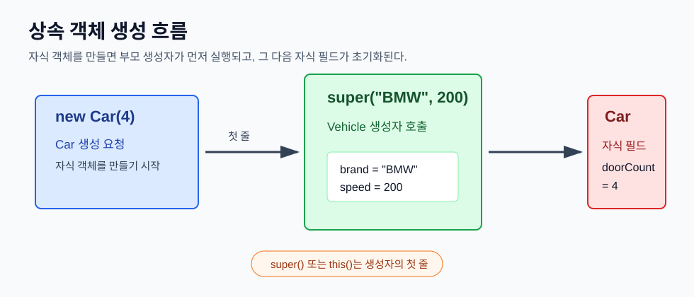
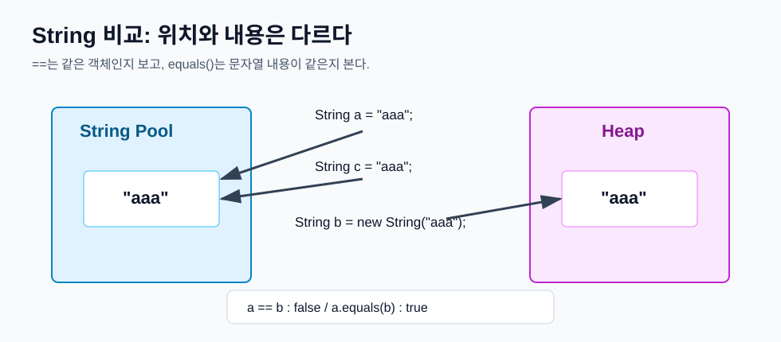
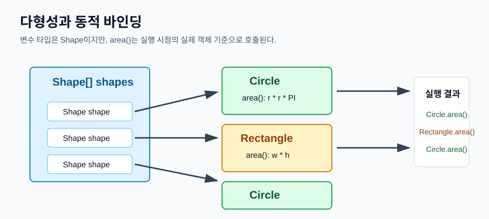

# Day 2. Java 생성자, 문자열, 상속, 다형성

> 목표: Java에서 객체가 만들어질 때 생성자가 어떻게 호출되는지 이해하고, 상속과 다형성을 통해 부모 타입으로 자식 객체를 다루는 흐름을 익힌다.

## 오늘 배운 것 한눈에 보기



오늘의 핵심은 **자식 객체를 만들면 부모 부분부터 먼저 만들어지고, 오버라이딩된 메서드는 실제 객체 기준으로 실행된다**는 것이다.

| 구분 | 핵심 의미 | 예시 |
| --- | --- | --- |
| 생성자 | 객체가 만들어질 때 필드를 초기화하는 특별한 메서드 | `new TV()` |
| `this()` | 같은 클래스의 다른 생성자를 호출한다. | `this(10);` |
| `super()` | 부모 클래스의 생성자를 호출한다. | `super(name);` |
| 오버로딩 | 같은 이름의 메서드를 매개변수로 구분한다. | `add(int, int)`, `add(double, double)` |
| 오버라이딩 | 부모 메서드를 자식 클래스에서 다시 정의한다. | `run()` 재정의 |
| 다형성 | 부모 타입 변수로 여러 자식 객체를 담는다. | `Shape s = new Circle();` |
| 동적 바인딩 | 실행 시점의 실제 객체 기준으로 메서드가 결정된다. | `s.area()` |

## 1. 생성자는 객체 초기화 담당이다

생성자는 객체가 만들어질 때 자동으로 호출된다. 보통 필드에 처음 값을 넣는 역할을 한다.

```java
class Employee {
    String name;

    public Employee() {
        System.out.println("Employee Constructor");
    }
}
```

생성자를 하나도 만들지 않으면 Java가 기본 생성자를 자동으로 넣어준다.

```java
class Member {
    // 생성자를 작성하지 않으면 아래 생성자가 있는 것처럼 동작한다.
    // public Member() {}
}
```

하지만 생성자를 하나라도 직접 만들면 기본 생성자는 자동으로 만들어지지 않는다.

```java
class Member {
    Member(String name) {
    }
}

// new Member(); // 컴파일 오류
```

초보자 기준으로는 이렇게 기억하면 된다.

| 상황 | 기본 생성자 자동 생성 |
| --- | --- |
| 생성자를 하나도 안 씀 | 자동 생성됨 |
| 생성자를 하나라도 직접 씀 | 자동 생성 안 됨 |

## 2. `this()`는 같은 클래스의 다른 생성자를 부른다

`this`가 현재 객체를 뜻했다면, `this()`는 **같은 클래스 안의 다른 생성자 호출**을 뜻한다.

```java
class TV {
    TV() {
        this(10);
    }

    TV(int c) {
        System.out.println(c);
    }
}
```

`new TV()`를 실행하면 먼저 `TV()` 생성자가 호출되고, 그 안에서 `this(10)`이 실행되어 `TV(int c)` 생성자로 이동한다.

중요한 규칙이 있다. `this()`는 생성자의 첫 줄에만 쓸 수 있다.

```java
TV() {
    // System.out.println("hello");
    this(10); // 첫 줄이 아니면 컴파일 오류
}
```

생성자끼리 연결할 때는 "객체 초기화 시작을 어디로 넘길지"를 먼저 결정해야 하기 때문에 첫 줄 규칙이 있다.

## 3. 오버로딩은 매개변수로 구분한다

오버로딩은 같은 이름의 메서드를 여러 개 만드는 것이다. 단, 매개변수의 개수나 타입이 달라야 한다.

```java
static int add(int a, int b) {
    return a + b;
}

static double add(double a, double b) {
    return a + b;
}
```

아래 코드는 같은 `add`를 호출하는 것처럼 보이지만, 컴파일러는 전달되는 값의 타입을 보고 어떤 메서드를 실행할지 정한다.

```java
add(10, 20);       // add(int, int)
add(10.0, 20.0);   // add(double, double)
```

정리하면 다음과 같다.

| 구분 | 설명 |
| --- | --- |
| 메서드 이름 | 같아도 된다. |
| 매개변수 | 개수나 타입이 달라야 한다. |
| 반환 타입만 다름 | 오버로딩이 아니다. |
| 결정 시점 | 컴파일 시점 |

## 4. 문자열은 내용 비교에 `equals()`를 쓴다



문자열 리터럴은 String Constant Pool에 저장된다.

```java
String a = "aaa";
String c = "aaa";
```

같은 문자열 리터럴은 같은 객체를 재사용할 수 있다. 그래서 `a == c`는 `true`가 될 수 있다.

반면 `new String("aaa")`는 Heap에 새 객체를 만든다.

```java
String b = new String("aaa");
```

`a`와 `b`는 내용은 같지만 객체 위치가 다르다.

```java
System.out.println(a == b);      // false
System.out.println(a.equals(b)); // true
```

문자열 비교에서 가장 중요한 규칙은 이것이다.

| 비교 | 의미 | 문자열 비교에 적합한가 |
| --- | --- | --- |
| `==` | 같은 객체를 가리키는지 비교 | 보통 부적합 |
| `equals()` | 문자열 내용이 같은지 비교 | 적합 |

비교 대상이 `null`일 수 있다면 `Objects.equals()`를 쓰면 안전하다.

```java
String d = null;

// d.equals("aaa"); // NullPointerException
System.out.println(Objects.equals(d, "aaa")); // false
```

`null`이 정상적으로 들어올 수 있는 값이면 `Objects.equals()`처럼 null-safe하게 처리한다. 반대로 `null`이 들어오면 안 되는 값이면 초기에 `Objects.requireNonNull()`로 명확하게 실패시키는 편이 좋다.

```java
Objects.requireNonNull(userId, "userId는 null일 수 없습니다.");
```

## 5. 상속은 부모의 공통 기능을 물려받는 것이다

상속은 공통 필드와 메서드를 부모 클래스에 두고, 자식 클래스가 그것을 물려받는 구조다.

```java
class Vehicle {
    protected String brand;
    protected int speed;

    public Vehicle(String brand, int speed) {
        this.brand = brand;
        this.speed = speed;
    }

    public void move() {
        System.out.println("~대가 달립니다");
    }
}
```

`Car`와 `Truck`은 모두 Vehicle의 한 종류이므로 `extends Vehicle`로 표현할 수 있다.

```java
class Car extends Vehicle {
    private int doorCount;

    public Car(int doorCount) {
        super("BMW", 200);
        this.doorCount = doorCount;
    }
}
```

자식 생성자에서 `super(...)`를 호출하면 부모 생성자로 값을 전달한다. 부모 필드는 부모 생성자가 초기화하고, 자식 필드는 자식 생성자가 초기화한다.

```java
public Car(int doorCount) {
    super("BMW", 200);          // 부모 부분 초기화
    this.doorCount = doorCount; // 자식 부분 초기화
}
```

`super(...)`도 `this()`처럼 생성자의 첫 줄에만 쓸 수 있다.

## 6. `super`는 부모 쪽 멤버를 가리킨다

`super`는 부모 객체 전체를 새로 만드는 말이 아니다. **상속받은 부모 부분에 접근하는 키워드**라고 이해하면 된다.

```java
class Student extends Person {
    private int studentNo;

    public Student(String name, int studentNo) {
        super(name);
        this.studentNo = studentNo;
    }

    @Override
    public String toString() {
        return String.format("%s, 학번: %d", super.toString(), studentNo);
    }
}
```

여기서 `super(name)`은 부모 생성자인 `Person(String name)`을 호출한다. `super.toString()`은 부모 클래스의 `toString()` 결과를 가져온다.

부모 쪽 로직을 재사용하면 같은 코드를 반복해서 쓰지 않아도 된다.

```java
// Person
return String.format("이름: %s", name);

// Student
return String.format("%s, 학번: %d", super.toString(), studentNo);
```

결과는 다음 형태가 된다.

```text
이름: Hong, 학번: 3
```

## 7. 필드 은닉과 메서드 오버라이딩은 다르다

상속에서 같은 이름의 필드를 자식 클래스에 다시 만들면 부모 필드는 사라지는 것이 아니라 가려진다. 이것을 필드 은닉이라고 볼 수 있다.

```java
class Animal {
    int id;
}

class Lion extends Animal {
    String id;

    void print() {
        System.out.println(id);
        System.out.println(super.id);
    }
}
```

`id`는 자식의 `String id`를 뜻하고, `super.id`는 부모의 `int id`를 뜻한다.

반면 메서드는 자식이 같은 형태로 다시 정의하면 오버라이딩된다.

```java
class Animal {
    void move() {
        System.out.println("move animal");
    }
}

class Lion extends Animal {
    @Override
    void move() {
        System.out.println("move lion");
    }
}
```

입문 단계에서는 이렇게 구분하면 된다.

| 구분 | 필드 | 메서드 |
| --- | --- | --- |
| 자식에서 같은 이름 선언 | 부모 필드가 가려짐 | 부모 메서드를 재정의 |
| 부모 것 접근 | `super.id` | `super.move()` |
| 대표 용어 | 은닉 | 오버라이딩 |

## 8. 추상 클래스는 미완성 설계도다

추상 클래스는 직접 객체를 만들 수 없는 클래스다.

```java
abstract class A {
}

// A a = new A(); // 컴파일 오류
```

추상 메서드는 내용이 없는 메서드다. 자식 클래스가 반드시 구현해야 한다.

```java
abstract class Shape {
    abstract double area();
}
```

추상 메서드가 하나라도 있으면 클래스도 반드시 `abstract`여야 한다. 추상 클래스는 추상 메서드와 일반 메서드를 모두 가질 수 있다.

```java
abstract class Shape {
    abstract double area();

    void printType() {
        System.out.println("도형");
    }
}
```

추상 클래스는 "공통 타입은 필요하지만, 구체적인 동작은 자식이 정해야 할 때" 사용한다.

## 9. 다형성은 부모 타입으로 자식 객체를 다루는 것이다



다형성은 하나의 부모 타입으로 여러 자식 객체를 담고 사용할 수 있는 성질이다.

```java
Shape[] shapes = {
    new Circle(3),
    new Rectangle(4, 5),
    new Circle(1)
};
```

배열의 타입은 `Shape[]`이지만 실제 들어있는 객체는 `Circle`, `Rectangle`, `Circle`이다.

```java
for (Shape shape : shapes) {
    System.out.println(shape.area());
}
```

컴파일러 입장에서는 `shape`가 `Shape` 타입으로 보인다. 하지만 실행 중에는 `shape`가 실제로 가리키는 객체가 `Circle`인지 `Rectangle`인지 확인하고, 그 객체의 `area()`를 실행한다.

이것이 동적 바인딩이다.

| 시점 | 무엇을 기준으로 보는가 | 예시 |
| --- | --- | --- |
| 컴파일 시점 | 참조 변수 타입 | `Shape shape` |
| 실행 시점 | 실제 객체 타입 | `new Circle(3)` |

## 10. 업캐스팅과 다운캐스팅

업캐스팅은 자식 객체를 부모 타입 변수에 담는 것이다.

```java
Car sonata = new Sonata();
```

`Sonata`는 `Car`의 한 종류이므로 자연스럽게 가능하다.

다운캐스팅은 부모 타입 변수를 다시 자식 타입으로 바꾸는 것이다.

```java
Car car = new Genesis();
Genesis genesis = (Genesis) car;
```

다운캐스팅은 컴파일은 될 수 있지만 실행 중 오류가 날 수 있다. 그래서 실제 객체가 원하는 타입인지 먼저 확인하는 습관이 필요하다.

```java
if (car instanceof Genesis) {
    Genesis genesis = (Genesis) car;
    genesis.autoPark();
}
```

정리하면 다음과 같다.

| 형변환 | 방향 | 명시적 캐스팅 필요 | 위험 |
| --- | --- | --- | --- |
| 업캐스팅 | 자식 -> 부모 | 보통 필요 없음 | 낮음 |
| 다운캐스팅 | 부모 -> 자식 | 필요함 | 실제 객체가 다르면 실행 오류 |

## 11. 정적 바인딩과 동적 바인딩

바인딩은 메서드 호출과 실제 실행될 메서드를 연결하는 것이다.

오버로딩은 컴파일 시점에 결정된다.

```java
add(10, 20);     // int 버전
add(10.0, 20.0); // double 버전
```

오버라이딩은 실행 시점에 실제 객체를 보고 결정된다.

```java
Car c = new Genesis();
c.run(); // Genesis의 run() 실행
```

| 구분 | 정적 바인딩 | 동적 바인딩 |
| --- | --- | --- |
| 결정 시점 | 컴파일 시점 | 실행 시점 |
| 기준 | 참조 변수 타입, 매개변수 타입 | 실제 객체 타입 |
| 대표 사례 | 오버로딩, `static`, `private`, `final` 메서드 | 오버라이딩 |
| 다형성과 관계 | 직접적인 핵심은 아님 | 다형성의 핵심 |

## 오늘 코드에서 확인한 예제

| 파일 | 확인한 내용 |
| --- | --- |
| `javaEX/src/ex5/constructor/ConstructTest.java` | 기본 생성자, 객체 생성 시 생성자 호출 |
| `javaEX/src/ex5/constructor/TVTest.java` | `this()` 생성자 호출은 첫 줄에서만 가능 |
| `javaEX/src/ex5/overloading/MethodOverloading.java` | 오버로딩은 매개변수 타입으로 구분 |
| `javaEX/src/ex6/StringTest.java` | 문자열 메서드, String Pool, `equals()`, `Objects.equals()` |
| `javaEX/src/ex7/Inheritance/SalarySystem.java` | 상속으로 부모 필드와 메서드 물려받기 |
| `javaEX/src/ex7/Inheritance/Test2.java` | 자식 생성자에서 `super()` 자동 호출, `this()`와 `super()` 흐름 |
| `javaEX/src/ex7/hiding/LionTest.java` | 필드 은닉, `super.id`, 메서드 오버라이딩 |
| `javaEX/src/ex7/abstractEx/Test.java` | 추상 클래스와 추상 메서드 |
| `javaEX/src/ex8/polymorphism/Test.java` | 부모 타입 매개변수로 여러 도형 객체 처리 |
| `javaEX/src/ex8/polymorphism/Test2.java` | 부모 타입 `Car`로 `Sonata`, `Genesis` 실행 |
| `javaEX/src/ex9/casting/CastingEx1.java` | 기본형 묵시적/명시적 형변환 |
| `javaEX/src/ex9/casting/ObjectCastingEx.java` | 객체 업캐스팅, `instanceof`, 다운캐스팅 |
| `javaEX/src/practice/lab02/inheritance/InheritanceTest.java` | `Vehicle`, `Car`, `Truck` 상속 실습 |
| `javaEX/src/practice/lab02/superEx/SuperTest.java` | `Person`, `Student`, `super.toString()` 실습 |
| `javaEX/src/practice/lab02/polymorphism/PolymorphismBindingTest.java` | `Shape[]` 배열과 동적 바인딩 실습 |

## 3개월 뒤 복습 체크리스트

- 생성자는 객체가 만들어질 때 필드를 초기화한다.
- 생성자를 직접 하나라도 만들면 기본 생성자는 자동으로 생기지 않는다.
- `this()`는 같은 클래스의 다른 생성자를 호출한다.
- `super()`는 부모 생성자를 호출하며 생성자의 첫 줄에 와야 한다.
- 오버로딩은 같은 이름의 메서드를 매개변수로 구분한다.
- 문자열 내용 비교는 `==`가 아니라 `equals()`를 사용한다.
- `null` 가능성이 있으면 `Objects.equals()`가 안전하다.
- 상속은 `is-a` 관계일 때 사용한다.
- 필드는 은닉될 수 있고, 메서드는 오버라이딩될 수 있다.
- 추상 클래스는 직접 객체 생성이 불가능하다.
- 추상 메서드는 자식 클래스가 구현해야 한다.
- 업캐스팅은 자식 객체를 부모 타입에 담는 것이다.
- 다운캐스팅 전에는 `instanceof`로 실제 타입을 확인하는 것이 안전하다.
- 오버로딩은 정적 바인딩, 오버라이딩은 동적 바인딩과 관련이 깊다.

## 한 문장 요약

Java의 상속과 다형성은 **부모 타입으로 공통 규칙을 세우고, 실행 시점에는 실제 자식 객체의 동작이 선택된다**는 흐름을 이해하는 것이 핵심이다.
