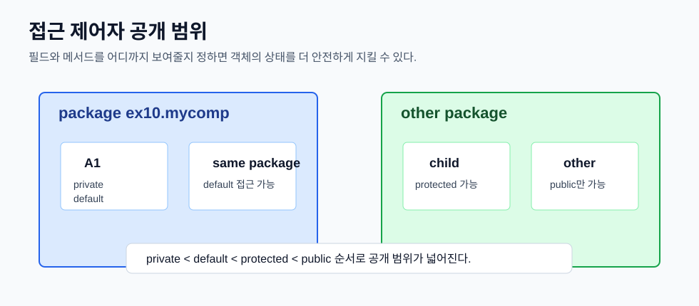
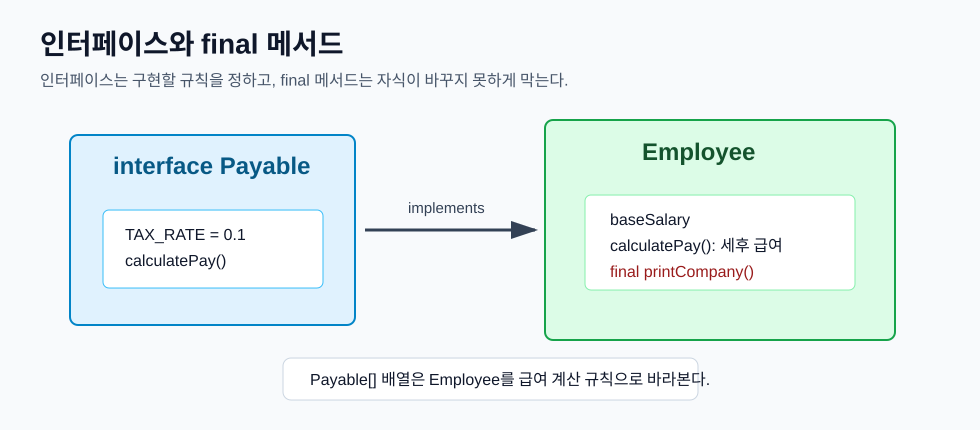
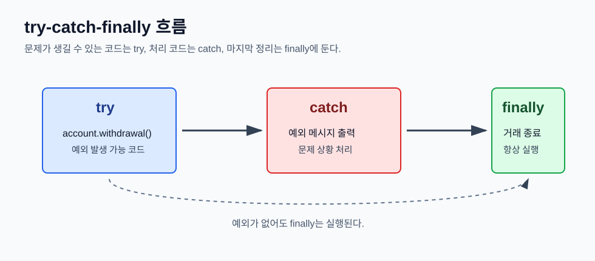
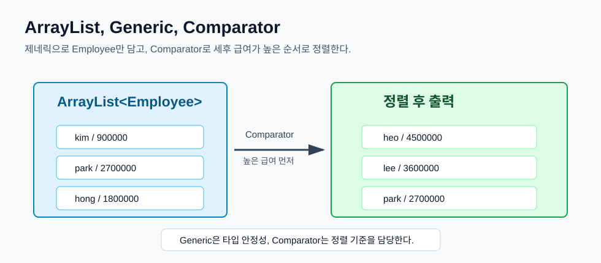

# Day 3. Java 패키지, 접근 제어자, final, 인터페이스, 예외, 컬렉션

> 목표: Java 코드가 패키지 단위로 나뉘는 방식을 이해하고, 접근 제어자와 `final`, 인터페이스, 예외 처리, `ArrayList`와 제네릭을 입문자 관점에서 정리한다.

## 오늘 배운 것 한눈에 보기



오늘의 핵심은 **클래스와 객체를 만들 줄 아는 것에서 한 단계 나아가, 코드를 안전하게 나누고 다루는 규칙을 익히는 것**이다.

| 구분 | 핵심 의미 | 예시 |
| --- | --- | --- |
| package | 클래스를 폴더처럼 묶어 이름 충돌을 줄인다. | `package ex10.mycomp.net;` |
| import | 다른 패키지의 클래스를 짧은 이름으로 쓰게 한다. | `import java.util.ArrayList;` |
| 접근 제어자 | 클래스, 필드, 메서드를 어디까지 공개할지 정한다. | `public`, `private` |
| final | 더 이상 바꾸거나 재정의하거나 상속하지 못하게 한다. | `final int MAX = 10;` |
| interface | 클래스가 반드시 구현해야 할 규칙을 정한다. | `implements Payable` |
| exception | 실행 중 문제가 생긴 상황을 객체로 표현한다. | `try-catch-finally` |
| collection | 여러 데이터를 담는 자료구조다. | `ArrayList<Employee>` |
| generic | 컬렉션에 담을 타입을 미리 정한다. | `List<String>` |

## 1. package는 클래스의 주소다

Java에서 `package`는 클래스를 묶는 이름 공간이다. 파일 시스템의 폴더 구조와 거의 맞춰서 생각하면 된다.

```java
package ex10.mycomp.net;

public class A2 {
}
```

이 클래스의 전체 이름은 `A2`가 아니라 `ex10.mycomp.net.A2`다. 같은 이름의 클래스가 여러 개 있어도 패키지가 다르면 구분할 수 있다.

다른 패키지의 클래스를 사용할 때는 전체 이름을 직접 쓸 수 있다.

```java
ex10.mycomp.A1 a1 = new ex10.mycomp.A1();
ex10.mycomp.net.A2 a2 = new ex10.mycomp.net.A2();
```

매번 전체 이름을 쓰기 번거로우면 `import`를 사용한다.

```java
import ex10.mycomp.A1;
import ex10.mycomp.net.A2;

A1 a1 = new A1();
A2 a2 = new A2();
```

입문 단계에서는 이렇게 기억하면 된다.

| 개념 | 역할 |
| --- | --- |
| `package` | 이 클래스가 어느 묶음에 속하는지 선언 |
| `import` | 다른 패키지 클래스를 짧은 이름으로 사용 |
| 전체 클래스 이름 | 패키지명까지 포함한 진짜 이름 |

## 2. 접근 제어자는 공개 범위를 정한다

접근 제어자는 클래스, 필드, 생성자, 메서드를 어디까지 사용할 수 있는지 정한다.

| 접근 제어자 | 같은 클래스 | 같은 패키지 | 다른 패키지의 자식 클래스 | 그 외 |
| --- | --- | --- | --- | --- |
| `public` | O | O | O | O |
| `protected` | O | O | O | X |
| default | O | O | X | X |
| `private` | O | X | X | X |

default는 키워드를 쓰는 것이 아니라 접근 제어자를 생략한 상태다.

```java
class Member {
    private String name;
    int age;

    public String getName() {
        return name;
    }
}
```

위 코드에서 `name`은 같은 클래스 안에서만 직접 접근할 수 있다. 외부에서는 `getName()` 같은 public 메서드를 통해 읽게 만든다.

초보자에게 가장 중요한 규칙은 이것이다.

| 대상 | 추천 접근 방식 |
| --- | --- |
| 필드 | 보통 `private` |
| 외부에서 써야 하는 메서드 | `public` |
| 같은 패키지 안에서만 쓸 클래스/메서드 | default |
| 상속 관계에서 자식에게 열어줄 멤버 | `protected` |

필드를 무조건 열어두면 아무 곳에서나 값이 바뀔 수 있다. 그래서 객체의 상태를 지키려면 필드를 `private`으로 두고, 필요한 메서드만 공개하는 방식이 좋다.

## 3. final은 더 이상 바꾸지 못하게 한다

`final`은 붙는 위치에 따라 의미가 조금씩 다르다.

| 위치 | 의미 | 예시 |
| --- | --- | --- |
| 변수 | 한 번 값을 넣으면 다시 대입할 수 없다. | `final int MAX = 10;` |
| 메서드 | 자식 클래스에서 오버라이딩할 수 없다. | `final void printCompany()` |
| 클래스 | 다른 클래스가 상속할 수 없다. | `final class String` |

변수에 붙이면 상수처럼 사용할 수 있다.

```java
final int MAX_COUNT = 100;
// MAX_COUNT = 200; // 컴파일 오류
```

메서드에 붙이면 자식 클래스가 재정의하지 못한다.

```java
class Employee {
    final void printCompany() {
        System.out.println("print company");
    }
}
```

회사명 출력처럼 모든 자식 클래스에서 똑같이 유지되어야 하는 동작이라면 `final` 메서드가 적합하다.

## 4. 인터페이스는 구현해야 할 약속이다

인터페이스는 "이 기능을 가진 클래스라면 반드시 이런 메서드를 제공해야 한다"는 규칙이다.

```java
interface Drawable {
    int PLAIN_PEN = 1;
    int BOLD_PEN = 2;

    void draw();
    void move(int x, int y);
}
```

인터페이스 안의 필드는 자동으로 `public static final`이다. 즉 상수다.

인터페이스 안의 추상 메서드는 자동으로 `public abstract`이다. 구현 클래스는 이 메서드를 반드시 구현해야 한다.

```java
class A1 implements Drawable {
    @Override
    public void draw() {
    }

    @Override
    public void move(int x, int y) {
    }
}
```

인터페이스를 구현할 때 메서드를 `public`으로 작성해야 한다. 인터페이스 메서드는 public인데, 구현 클래스에서 접근 범위를 더 좁힐 수 없기 때문이다.

## 5. Payable 실습: 급여 계산 규칙 만들기



`Payable` 인터페이스는 급여를 계산할 수 있는 객체의 규칙이다.

```java
public interface Payable {
    double TAX_RATE = 0.1;

    double calculatePay();
}
```

`TAX_RATE`는 선언만 해도 자동으로 `public static final` 상수다. `calculatePay()`는 구현 클래스가 반드시 작성해야 하는 추상 메서드다.

```java
public class Employee implements Payable {
    private String name;
    private int baseSalary;

    @Override
    public double calculatePay() {
        return baseSalary * (1 - TAX_RATE);
    }

    final void printCompany() {
        System.out.println("print company");
    }
}
```

`Employee`는 `Payable`을 구현했기 때문에 `calculatePay()`를 반드시 작성해야 한다. 세후 급여는 기본 급여에서 세율 10%를 뺀 값으로 계산한다.

```java
Payable[] payables = new Employee[3];
payables[0] = new Employee(3_000_000);
payables[1] = new Employee(2_000_000);
payables[2] = new Employee(4_000_000);

for (Payable payable : payables) {
    System.out.println(payable.calculatePay());
}
```

배열 타입은 `Payable[]`이다. 실제 객체는 `Employee`지만, 급여 계산 기능만 필요하므로 인터페이스 타입으로 다룰 수 있다.

## 6. 예외는 프로그램 실행 중 생기는 문제다

예외는 프로그램이 실행되는 중에 발생하는 문제 상황이다.

예를 들어 다음 코드는 0으로 나누기 때문에 `ArithmeticException`이 발생할 수 있다.

```java
int i = 0;
int result = 10 / i;
```

`null`인 문자열에서 메서드를 호출하면 `NullPointerException`이 발생한다.

```java
String str = null;
str.substring(1);
```

배열 범위를 벗어난 위치에 접근하면 `ArrayIndexOutOfBoundsException`이 발생한다.

```java
int[] datas = {10, 20, 30, 40};
datas[4] = 20;
```

예외를 처리하지 않으면 프로그램이 중간에 멈출 수 있다. 그래서 문제가 생길 수 있는 코드를 `try` 안에 넣고, 처리 코드를 `catch`에 작성한다.

```java
try {
    int result = 10 / 0;
} catch (Exception e) {
    System.out.println("예외 발생: " + e);
}
```

## 7. catch는 구체적인 예외부터 작성한다

여러 예외를 따로 처리할 때는 자식 예외를 먼저 쓰고, 부모 예외를 뒤에 써야 한다.

```java
try {
    int i = Integer.parseInt("aaa");
    int r = 100 / 0;
} catch (ArithmeticException e) {
    System.out.println("예외발생1");
} catch (NumberFormatException e) {
    System.out.println("예외발생2");
} catch (Exception e) {
    System.out.println("예외발생3");
}
```

`Exception`은 많은 예외의 부모 타입이다. 이것을 맨 앞에 두면 뒤쪽의 구체적인 예외들은 도달할 수 없는 코드가 된다.

입문자 기준으로는 이렇게 기억하면 된다.

| catch 순서 | 이유 |
| --- | --- |
| 구체적인 예외 먼저 | 정확한 원인을 따로 처리할 수 있음 |
| 넓은 예외는 뒤쪽 | 마지막 공통 처리 역할 |

## 8. finally는 항상 실행된다



`finally` 블록은 예외가 발생하든 안 하든 실행된다.

```java
try {
    account.withdrawal(10_000);
} catch (Exception e) {
    System.out.println(e.getMessage());
} finally {
    System.out.println("거래 종료");
}
```

그래서 파일 닫기, 연결 종료, 거래 종료 메시지처럼 마지막에 반드시 실행해야 하는 코드를 넣기에 좋다.

주의할 점도 있다. `catch`가 모든 예외를 잡는 것은 아니다. 잡으려는 예외 타입과 실제 예외 타입이 맞지 않으면 예외는 계속 밖으로 전달된다.

```java
try {
    String str = null;
    str.substring(1);
} catch (ArithmeticException e) {
    System.out.println("catch");
} finally {
    System.out.println("finally");
}
```

위 코드는 `NullPointerException`이 발생한다. `catch`는 `ArithmeticException`만 잡으므로 처리하지 못한다. 그래도 `finally`는 실행된다.

## 9. throws는 호출한 쪽으로 예외 처리를 미루는 것이다

`throws`는 예외를 여기서 바로 처리하지 않고, 이 메서드를 호출한 쪽으로 넘기겠다는 뜻이다.

```java
static void m1() throws Exception {
    m2();
}

static void m2() throws Exception {
    int result = 10 / 0;
}
```

이 경우 `m1()`을 호출하는 쪽에서 `try-catch`로 처리할 수 있다.

```java
try {
    m1();
} catch (Exception e) {
    System.out.println("예외 발생");
}
```

checked exception은 메서드 선언에 `throws`를 적거나 호출부에서 `try-catch`로 처리해야 한다. 반면 `RuntimeException` 계열은 컴파일러가 강제하지 않는다.

| 구분 | 컴파일러가 처리 강제 | 예시 |
| --- | --- | --- |
| checked exception | O | `Exception`, `IOException` |
| unchecked exception | X | `RuntimeException`, `NullPointerException` |

## 10. 사용자 정의 예외: 계좌 출금 실습

직접 예외 클래스를 만들 수도 있다.

```java
public class InsufficientBalanceException extends Exception {
    public InsufficientBalanceException(String message) {
        super(message);
    }
}
```

`Exception`을 상속했기 때문에 checked exception이다. 이 예외를 던지는 메서드는 `throws`를 선언해야 한다.

```java
public int withdrawal(int amount) throws InsufficientBalanceException {
    if (amount > balance) {
        throw new InsufficientBalanceException("Insufficient balance");
    }

    return this.balance -= amount;
}
```

호출하는 쪽에서는 `try-catch-finally`로 처리한다.

```java
try {
    account.withdrawal(10_000);
} catch (Exception e) {
    System.out.println(e.getMessage());
} finally {
    System.out.println("거래 종료");
}
```

이 구조는 "출금하려는 금액이 잔액보다 크면 예외를 던지고, 호출부에서 메시지를 출력한 뒤 거래를 종료한다"는 흐름이다.

## 11. clone과 복사: 얕은 복사와 깊은 복사

객체를 복사할 때는 두 가지 개념을 구분해야 한다.

| 복사 방식 | 의미 | 특징 |
| --- | --- | --- |
| 얕은 복사 | 객체 안의 참조값을 그대로 복사 | 내부 객체를 공유할 수 있음 |
| 깊은 복사 | 내부 객체까지 새로 만들어 복사 | 서로 독립적인 객체가 됨 |

예를 들어 `Person`이 `Car`를 가지고 있다고 생각해 보자.

```java
class Person {
    Car car;
}
```

얕은 복사를 하면 `Person` 객체는 새로 생겨도 내부의 `Car`는 같은 객체를 함께 가리킬 수 있다. 한쪽에서 `Car` 상태를 바꾸면 다른 쪽에서도 바뀐 것처럼 보일 수 있다.

깊은 복사를 하려면 `Person`뿐 아니라 내부의 `Car`도 새로 만들어야 한다.

입문 단계에서는 "객체 안에 또 다른 객체 참조가 있으면 복사할 때 공유 문제가 생길 수 있다" 정도를 먼저 잡으면 된다.

## 12. 배열과 컬렉션은 여러 데이터를 담는다

배열은 크기가 고정되어 있다.

```java
String[] names = new String[3];
```

처음에 3칸으로 만들면 자동으로 4칸, 5칸으로 늘어나지 않는다.

반면 `ArrayList`는 데이터를 추가하면 내부 크기를 자동으로 관리한다.

```java
ArrayList list = new ArrayList();
list.add(1);
list.add("test");
```

위 코드는 컴파일은 되지만 숫자와 문자열이 섞여 들어간다. 꺼내서 사용할 때 타입을 직접 확인하거나 변환해야 해서 위험하다.

## 13. Generic은 컬렉션에 들어갈 타입을 정한다

제네릭을 사용하면 컬렉션에 담을 타입을 미리 정할 수 있다.

```java
List<String> list = new ArrayList<>();
list.add("a");
list.add("b");
list.add("c");
```

이제 `list`에는 문자열만 넣을 수 있다.

```java
ArrayList<B> list = new ArrayList<>();

B b1 = new B(1);
B b2 = new B(2);

list.add(b1);
list.add(b2);
```

제네릭을 쓰면 꺼낼 때 다운캐스팅을 직접 하지 않아도 된다.

```java
B b = list.get(i);
```

제네릭을 쓰지 않았다면 `Object`로 꺼내진 값을 다시 `B`로 바꿔야 했을 수 있다.

```java
// B b = (B) list.get(i);
```

정리하면 다음과 같다.

| 구분 | 제네릭 없음 | 제네릭 있음 |
| --- | --- | --- |
| 담을 수 있는 값 | 여러 타입이 섞일 수 있음 | 지정한 타입만 가능 |
| 꺼낼 때 | 형변환이 필요할 수 있음 | 지정 타입으로 바로 사용 |
| 안정성 | 낮음 | 높음 |

## 14. ArrayList로 직원 관리하기



`ArrayList<Employee>`는 `Employee` 객체만 담는 리스트다.

```java
ArrayList<Employee> employees = new ArrayList<>();
employees.add(new Employee("kim", 1_000_000));
employees.add(new Employee("park", 3_000_000));
employees.add(new Employee("hong", 2_000_000));
```

for-each 문으로 순회하면서 각 직원의 세후 급여를 출력하고 총합을 구할 수 있다.

```java
double totalAmount = 0;

for (Employee employee : employees) {
    totalAmount += employee.calculatePay();
    System.out.printf("%s의 세후 급여는 %.0f 입니다.\n",
            employee.getName(),
            employee.calculatePay());
}

System.out.printf("총합은 %.0f입니다.\n", totalAmount);
```

정렬 기준을 직접 정하려면 `Comparator`를 사용한다.

```java
employees.sort((e1, e2) ->
        Double.compare(e2.getBaseSalary(), e1.getBaseSalary())
);
```

`Double.compare(e2, e1)`처럼 뒤의 값을 앞에 두면 큰 값이 먼저 오는 내림차순 정렬이 된다.

요구사항에서 `Collections.sort()`를 사용하라고 하면 아래처럼 쓸 수 있다.

```java
Collections.sort(employees, (e1, e2) ->
        Double.compare(e2.calculatePay(), e1.calculatePay())
);
```

`employees.sort(...)`와 `Collections.sort(employees, ...)`는 둘 다 리스트를 정렬할 수 있지만, 과제에서 특정 방식을 요구하면 그 방식에 맞추는 것이 좋다.

## 오늘 코드에서 확인한 예제

| 파일 | 확인한 내용 |
| --- | --- |
| `javaEX/src/ex9/init/ObjectInit.java` | 기본 생성자와 매개변수 생성자로 객체 초기화 |
| `javaEX/src/ex9/relation/CarTest.java` | `is-a` 상속 관계와 `has-a` 포함 관계 |
| `javaEX/src/ex10/mycomp/A1.java` | 패키지 선언 |
| `javaEX/src/ex10/mycomp/net/A2.java` | 하위 패키지 선언 |
| `javaEX/src/ex10/mycomp/net/A3.java` | 같은 패키지의 클래스 구분 |
| `javaEX/src/ex10/mycomp/ui/B1.java` | 다른 패키지 클래스의 전체 이름 사용 |
| `javaEX/src/ex12/InterfaceEx.java` | 인터페이스 상수, 추상 메서드, `implements` |
| `javaEX/src/ex13/exception/ExceptionTest1.java` | `ArithmeticException` 예시 |
| `javaEX/src/ex13/exception/ExceptionTest2.java` | `NullPointerException`, 배열 범위 예외 예시 |
| `javaEX/src/ex13/exception/ExceptionTest3.java` | `try-catch` 기본 구조 |
| `javaEX/src/ex13/exception/ExceptionTest4.java` | 여러 `catch`와 예외 처리 순서 |
| `javaEX/src/ex13/exception/ExceptionTest5.java` | `finally`는 예외 발생 여부와 관계없이 실행 |
| `javaEX/src/ex13/exception/ThrowsTest.java` | `throws`로 호출부에 예외 전달 |
| `javaEX/src/ex14/MathTest.java` | `Math.random()`과 `switch` 표현식 |
| `javaEX/src/ex14/stringEx/StringTest.java` | 문자열 비교에서 `==`와 `equals()` 차이 |
| `javaEX/src/ex14/stringEx/StringTest2.java` | `split()`으로 문자열 나누기 |
| `javaEX/src/ex15/datastructure/ArrayListTest.java` | raw `ArrayList` 사용과 순회 |
| `javaEX/src/ex15/datastructure/ArrayListTest2.java` | `List<String>` 제네릭 사용 |
| `javaEX/src/ex15/generic/GenericTest.java` | 제네릭으로 다운캐스팅 없이 객체 사용 |
| `javaEX/src/practice/lab03/finalinterface/Payable.java` | 인터페이스 상수와 추상 메서드 |
| `javaEX/src/practice/lab03/finalinterface/Employee.java` | `Payable` 구현, 세후 급여 계산, `final` 메서드 |
| `javaEX/src/practice/lab03/finalinterface/EmployTest.java` | `Payable[]` 배열로 급여 계산 호출 |
| `javaEX/src/practice/lab03/exception/InsufficientBalanceException.java` | checked 사용자 정의 예외 |
| `javaEX/src/practice/lab03/exception/Account.java` | 잔액 부족 시 예외 던지기 |
| `javaEX/src/practice/lab03/exception/ExceptionTest.java` | `try-catch-finally`로 출금 예외 처리 |
| `javaEX/src/practice/lab03/datastructure/DataTest.java` | `ArrayList<Employee>`로 직원 관리와 급여 정렬 |

## 3개월 뒤 복습 체크리스트

- `package`는 클래스의 소속 주소다.
- 다른 패키지 클래스를 짧게 쓰려면 `import`를 사용한다.
- 필드는 보통 `private`으로 숨기고 필요한 메서드만 공개한다.
- `public`은 어디서든 접근 가능하다.
- default는 같은 패키지 안에서만 접근 가능하다.
- `protected`는 같은 패키지와 다른 패키지의 자식 클래스에서 접근 가능하다.
- `private`은 같은 클래스 안에서만 접근 가능하다.
- `final` 변수는 다시 대입할 수 없다.
- `final` 메서드는 오버라이딩할 수 없다.
- `final` 클래스는 상속할 수 없다.
- 인터페이스 필드는 자동으로 `public static final`이다.
- 인터페이스 추상 메서드는 구현 클래스에서 `public`으로 구현해야 한다.
- `try`는 예외가 발생할 수 있는 코드를 감싼다.
- `catch`는 발생한 예외를 처리한다.
- `finally`는 예외 발생 여부와 관계없이 실행된다.
- checked exception은 `throws` 또는 `try-catch` 처리가 필요하다.
- `throw`는 실제 예외 객체를 던지는 코드다.
- `throws`는 이 메서드가 예외를 밖으로 던질 수 있다고 선언하는 코드다.
- 배열은 크기가 고정되어 있다.
- `ArrayList`는 데이터를 추가하면 크기를 자동으로 관리한다.
- 제네릭은 컬렉션에 들어갈 타입을 미리 정해 타입 안정성을 높인다.
- `Comparator`는 정렬 기준을 직접 만드는 인터페이스다.

## 한 문장 요약

Day 3의 핵심은 **Java 코드를 패키지와 접근 제어자로 안전하게 나누고, 인터페이스와 예외, 컬렉션과 제네릭으로 더 실제 프로그램다운 구조를 만드는 것**이다.
