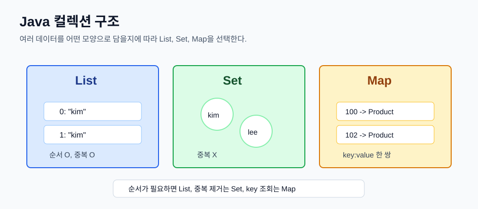
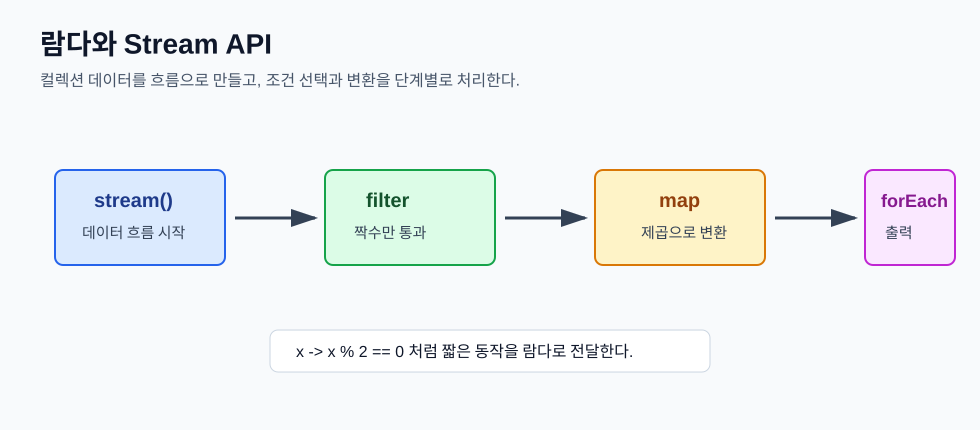
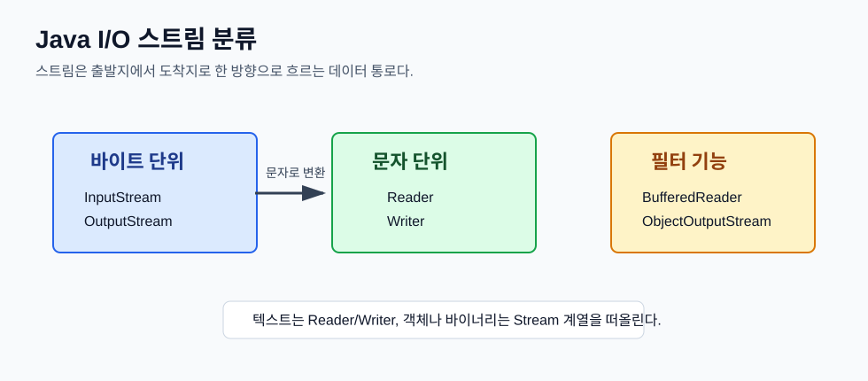
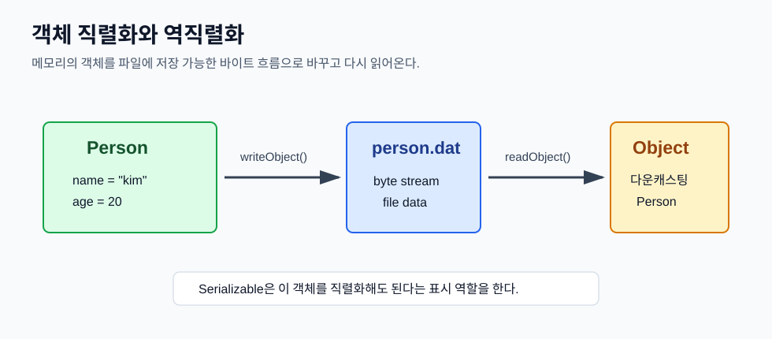

# Day 4. Java 컬렉션, 람다, Stream API, I/O, 직렬화

> 목표: 여러 데이터를 다루는 컬렉션 구조를 구분하고, 람다와 Stream API로 데이터를 처리하며, Java I/O와 직렬화로 파일에 데이터를 저장하고 읽는 흐름을 이해한다.

## 오늘 배운 것 한눈에 보기



오늘의 핵심은 **데이터를 어떤 모양으로 담을지 먼저 정하고, 그 데이터 흐름을 람다/스트림/I/O로 처리하는 방법을 익히는 것**이다.

| 구분 | 핵심 의미 | 예시 |
| --- | --- | --- |
| `List` | 순서가 있고 중복을 허용한다. | `ArrayList`, `LinkedList` |
| `Set` | 중복을 허용하지 않는다. | `HashSet`, `TreeSet` |
| `Map` | key와 value를 한 쌍으로 저장한다. | `HashMap`, `TreeMap` |
| 람다 | 짧은 함수 표현식이다. | `(x, y) -> y - x` |
| 익명 클래스 | 이름 없는 클래스를 즉석에서 만든다. | `new Comparator<>() { ... }` |
| Stream API | 컬렉션 데이터를 흐름처럼 처리한다. | `filter`, `map`, `forEach` |
| I/O | 프로그램 밖과 데이터를 주고받는다. | 파일 읽기/쓰기 |
| 직렬화 | 객체를 파일에 저장 가능한 형태로 바꾼다. | `Serializable` |

## 1. 컬렉션은 여러 데이터를 담는 도구다

배열도 여러 데이터를 담을 수 있지만 크기가 고정되어 있다.

```java
String[] names = new String[3];
```

처음에 3칸으로 만들면 자동으로 4칸, 5칸으로 늘어나지 않는다. 반면 컬렉션은 데이터를 추가하고 삭제하는 일이 더 편하다.

Java 컬렉션은 크게 `List`, `Set`, `Map`으로 나눠서 볼 수 있다.

| 종류 | 저장 방식 | 중복 | 순서 |
| --- | --- | --- | --- |
| `List` | 값 하나씩 저장 | 허용 | 있음 |
| `Set` | 값 하나씩 저장 | 허용 안 함 | 구현체마다 다름 |
| `Map` | key와 value 한 쌍으로 저장 | key 중복 불가 | 구현체마다 다름 |

## 2. List: 순서가 중요한 데이터

`List`는 데이터를 넣은 순서가 중요하고, 같은 값을 여러 번 넣을 수 있는 구조다.

```java
ArrayList<Integer> list = new ArrayList<>();

for (int i = 0; i < 5; i++) {
    list.add(i * 10);
}
```

위 코드를 실행하면 리스트에는 `0, 10, 20, 30, 40`이 순서대로 들어간다.

```java
list.set(3, 33);
list.remove(Integer.valueOf(40));
```

`set(3, 33)`은 3번 인덱스의 값을 바꾼다. `remove(Integer.valueOf(40))`은 값 `40`을 찾아 지운다.

입문자 기준으로 `ArrayList`와 `LinkedList`는 이렇게 구분하면 된다.

| 구현체 | 특징 | 처음 배울 때 기억할 점 |
| --- | --- | --- |
| `ArrayList` | 내부적으로 배열에 가깝다. | 조회가 편하고 가장 자주 쓴다. |
| `LinkedList` | 앞뒤 노드가 연결된 구조다. | 중간 삽입/삭제 개념을 이해할 때 좋다. |

대부분의 입문 실습에서는 `ArrayList`를 먼저 쓰면 된다.

## 3. Set: 중복을 막는 데이터

`Set`은 같은 값을 중복해서 저장하지 않는다.

```java
Set<String> names = new HashSet<>();
names.add("kim");
names.add("kim");
names.add("lee");
```

`"kim"`을 두 번 넣어도 하나만 남는다.

| 구현체 | 특징 |
| --- | --- |
| `HashSet` | 중복 제거가 목적일 때 많이 쓴다. 순서는 보장하지 않는다. |
| `TreeSet` | 중복을 제거하면서 정렬된 상태를 유지한다. |

즉, "중복 없이 보관"이 목표면 `HashSet`, "중복 없이 정렬까지" 필요하면 `TreeSet`을 떠올리면 된다.

## 4. Map: key로 value를 찾는 데이터

`Map`은 값 하나만 저장하지 않고, key와 value를 한 쌍으로 저장한다.

```java
Map<Integer, Product> map = new HashMap<>();
map.put(product.getProductId(), product);
```

상품 관리 실습에서는 상품 번호를 key로, 상품 객체를 value로 저장했다.

```java
public Product getProductById(int productId) {
    return map.get(productId);
}

public void removeProductById(int productId) {
    map.remove(productId);
}
```

`productId`를 알면 상품을 빠르게 찾거나 삭제할 수 있다.

| 구현체 | 특징 |
| --- | --- |
| `HashMap` | key로 value를 빠르게 찾는 데 많이 쓴다. 순서는 보장하지 않는다. |
| `TreeMap` | key 기준으로 정렬된 상태를 유지한다. |

`Map`은 전화번호부처럼 생각하면 쉽다. 이름이나 번호 같은 key를 넣으면 그에 대응하는 value를 찾는다.

## 5. 제네릭은 컬렉션의 타입 안전장치다

제네릭 없이 컬렉션을 쓰면 여러 타입이 섞일 수 있다.

```java
ArrayList list = new ArrayList();
list.add(1);
list.add("test");
```

컴파일은 되지만 꺼내서 사용할 때 타입을 매번 조심해야 한다.

제네릭을 쓰면 담을 타입을 미리 정한다.

```java
ArrayList<Integer> list = new ArrayList<>();
List<String> names = new ArrayList<>();
Map<Integer, Product> products = new HashMap<>();
```

이렇게 작성하면 엉뚱한 타입을 넣는 실수를 컴파일 단계에서 막을 수 있다.

| 코드 | 의미 |
| --- | --- |
| `ArrayList<Integer>` | 정수만 담는 리스트 |
| `List<String>` | 문자열만 담는 리스트 |
| `Map<Integer, Product>` | 정수 key로 상품을 찾는 지도 |

## 6. for-each는 전체 순회에 좋다

리스트 전체를 순회하면서 합계를 구할 때 for-each 문을 사용할 수 있다.

```java
int total = 0;

for (Integer num : list) {
    total += num;
}
```

인덱스가 꼭 필요하지 않다면 일반 `for`문보다 읽기 쉽다.

```java
for (Employee employee : employees) {
    System.out.println(employee.getName());
}
```

for-each는 "처음부터 끝까지 하나씩 꺼내서 처리한다"는 뜻으로 읽으면 된다.

## 7. 익명 클래스는 이름 없는 일회용 클래스다

정렬 기준처럼 한 번만 필요한 구현은 익명 클래스로 만들 수 있다.

```java
Collections.sort(list, new Comparator<Integer>() {
    @Override
    public int compare(Integer x, Integer y) {
        return Integer.compare(y, x);
    }
});
```

이 코드는 `Comparator<Integer>`를 구현하는 클래스를 따로 파일로 만들지 않고, 그 자리에서 바로 만든 것이다.

익명 클래스는 문법이 길다. 그래서 함수형 인터페이스를 사용할 때는 람다로 더 짧게 표현할 수 있다.

## 8. 람다는 짧은 함수 표현식이다



람다는 메서드를 값처럼 전달할 수 있게 해주는 짧은 문법이다.

```java
Collections.sort(list, (x, y) -> Integer.compare(y, x));
```

위 코드는 두 값을 비교해서 큰 값이 앞에 오도록 정렬한다. 즉 내림차순 정렬이다.

람다의 기본 모양은 다음과 같다.

```java
(매개변수) -> 실행할 코드
```

예를 들어 짝수만 고르는 조건은 이렇게 쓸 수 있다.

```java
x -> x % 2 == 0
```

숫자를 제곱하는 변환은 이렇게 쓸 수 있다.

```java
x -> x * x
```

람다는 특히 `sort`, `filter`, `map`, `forEach` 같은 곳에서 자주 사용된다.

## 9. Stream API는 데이터 처리 파이프라인이다

Stream API는 컬렉션 데이터를 하나씩 흘려보내면서 처리하는 방식이다.

```java
list.stream()
        .filter(x -> x % 2 == 0)
        .map(x -> x * x)
        .forEach(System.out::println);
```

이 코드는 다음 순서로 읽으면 된다.

| 단계 | 의미 |
| --- | --- |
| `stream()` | 리스트를 데이터 흐름으로 만든다. |
| `filter(...)` | 조건에 맞는 값만 통과시킨다. |
| `map(...)` | 값을 다른 값으로 바꾼다. |
| `forEach(...)` | 하나씩 꺼내 마지막 작업을 한다. |

이름 목록 예제도 같은 흐름이다.

```java
names.stream()
        .filter(name -> name.endsWith("희"))
        .map(String::length)
        .filter(cnt -> cnt >= 3)
        .forEach(System.out::println);
```

위 코드는 이름이 `"희"`로 끝나는 사람만 고르고, 이름 길이로 바꾼 다음, 길이가 3 이상인 값만 출력한다.

주의할 점도 있다.

```java
long count = names.stream()
        .map(name -> name.startsWith("김"))
        .count();
```

이 코드는 `"김"`으로 시작하는 사람 수를 세는 코드처럼 보이지만 실제로는 모든 이름을 `true` 또는 `false`로 바꾼 뒤 전체 개수를 센다. 그래서 전체 인원 수가 나온다.

조건에 맞는 개수를 세려면 `map`이 아니라 `filter`를 써야 한다.

```java
long count = names.stream()
        .filter(name -> name.startsWith("김"))
        .count();
```

## 10. 자바 I/O는 외부와 데이터를 주고받는 통로다



I/O는 Input/Output의 줄임말이다. 프로그램 기준으로 데이터가 들어오면 입력, 나가면 출력이다.

스트림은 데이터를 한 방향으로 순서대로 보내는 통로다.

| 특징 | 의미 |
| --- | --- |
| 한 방향 | 읽기 스트림과 쓰기 스트림이 따로 있다. |
| 순서대로 전달 | 앞에서부터 차례로 읽고 쓴다. |
| 출발지와 도착지 | 파일, 키보드, 화면, 네트워크 등이 될 수 있다. |

I/O 클래스는 크게 문자 단위와 바이트 단위로 나눌 수 있다.

| 기준 | 입력 | 출력 | 용도 |
| --- | --- | --- | --- |
| 문자 단위 | `Reader` | `Writer` | 텍스트 파일 |
| 바이트 단위 | `InputStream` | `OutputStream` | 이미지, 영상, 객체 등 |

실제 파일에 직접 연결하는 클래스와, 기능을 덧붙이는 필터 클래스도 구분한다.

| 종류 | 예시 | 역할 |
| --- | --- | --- |
| 실제 I/O | `FileInputStream`, `FileReader`, `FileWriter` | 파일에 직접 연결 |
| 필터 기능 | `BufferedReader`, `ObjectOutputStream`, `Scanner` | 읽기 편의, 버퍼, 객체 변환 등 |

## 11. Scanner와 BufferedReader

키보드 입력은 `System.in`에서 시작한다. `System.in`은 바이트 단위 입력 스트림이다.

```java
Scanner scan = new Scanner(System.in);
```

`Scanner`는 입력값을 정수, 실수, 문자열로 쉽게 읽게 해준다.

```java
int data1 = scan.nextInt();
double data2 = scan.nextDouble();
String data3 = scan.nextLine();
```

주의할 점은 `nextInt()`나 `nextDouble()`이 줄바꿈 문자를 남겨둘 수 있다는 것이다. 그래서 바로 `nextLine()`을 읽기 전에 남은 줄바꿈을 한 번 제거해야 한다.

```java
scan.nextLine();
String data3 = scan.nextLine();
```

`BufferedReader`는 한 줄씩 읽을 때 자주 쓰는 보조 스트림이다.

```java
InputStreamReader r = new InputStreamReader(System.in);
BufferedReader br = new BufferedReader(r);
```

`InputStreamReader`는 바이트 입력을 문자 입력으로 바꿔주는 다리 역할을 한다.

## 12. 파일 쓰기와 읽기

텍스트 파일에 글자를 쓸 때는 `FileWriter`를 사용할 수 있다.

```java
FileWriter fw = new FileWriter("students.txt");

fw.write("hong,90\n");
fw.write("kim,85\n");
fw.write("lee,95\n");
```

파일을 다 썼으면 닫아야 한다.

```java
finally {
    if (fw != null) {
        fw.close();
    }
}
```

파일을 읽을 때는 `FileReader`와 `Scanner`를 함께 사용할 수 있다.

```java
try (Scanner sc = new Scanner(new FileReader("students.txt"))) {
    while (sc.hasNextLine()) {
        String line = sc.nextLine();
        String[] data = line.split(",");
    }
}
```

`try-with-resources` 문법을 사용하면 `Scanner` 같은 자원을 자동으로 닫아준다.

```java
try (Scanner sc = new Scanner(new FileReader("students.txt"))) {
    // 파일 읽기
}
```

쉼표로 구분된 한 줄은 `split(",")`으로 나눌 수 있다.

```java
String[] data = line.split(",");
String name = data[0];
String score = data[1];
```

## 13. 직렬화는 객체를 파일에 저장 가능한 형태로 바꾸는 것이다



객체는 메모리 안에 있을 때는 필드와 참조를 가진 복잡한 구조다. 이 객체를 파일에 저장하거나 네트워크로 보내려면 바이트 흐름으로 바꿔야 한다. 이것을 직렬화라고 한다.

직렬화하려는 클래스는 `Serializable` 인터페이스를 구현해야 한다.

```java
class Person implements Serializable {
    private String name;
    private int age;
}
```

`Serializable`은 메서드가 없는 마커 인터페이스다. "이 클래스의 객체는 직렬화해도 된다"는 표시 역할을 한다.

객체를 파일에 쓸 때는 `ObjectOutputStream`을 사용한다.

```java
try (ObjectOutputStream oos = new ObjectOutputStream(
        new FileOutputStream("person.dat"))) {

    oos.writeObject(new Person("kim", 20));
    oos.writeObject(new Person("na", 25));
}
```

파일에서 객체를 읽을 때는 `ObjectInputStream`을 사용한다.

```java
try (ObjectInputStream ois = new ObjectInputStream(
        new FileInputStream("person.dat"))) {

    Person kim = (Person) ois.readObject();
}
```

`readObject()`는 `Object` 타입으로 값을 돌려준다. 그래서 원래 타입으로 다운캐스팅해야 한다.

## 14. Serializable을 implements 해야 하는 이유

`Serializable`은 비어 있는 인터페이스지만 중요한 의미가 있다.

```java
class A implements Serializable {
    int a;
}
```

Java는 아무 객체나 자동으로 파일에 저장하지 않는다. 객체 안에는 파일로 저장하면 안 되거나 저장할 수 없는 값이 들어 있을 수도 있기 때문이다.

그래서 개발자가 `implements Serializable`을 붙여서 "이 클래스의 객체는 저장해도 된다"라고 명시해야 한다.

| 질문 | 답 |
| --- | --- |
| `Serializable`에 메서드가 있나? | 없다. |
| 그럼 왜 붙이나? | 직렬화 가능 클래스라는 표시다. |
| 안 붙이면? | `NotSerializableException`이 발생할 수 있다. |
| 읽을 때는? | `readObject()` 후 원래 타입으로 캐스팅한다. |

## 오늘 코드에서 확인한 예제

| 파일 | 확인한 내용 |
| --- | --- |
| `javaEX/src/ex16/ScannerTest.java` | `Scanner`, `nextInt()`, `nextDouble()`, `nextLine()` 개행 처리, `BufferedReader` |
| `javaEX/src/ex16/StreamTest.java` | `stream()`, `map`, `filter`, `count`, 메서드 참조 |
| `javaEX/src/ex17/ObjectOutputTest.java` | `ObjectOutputStream`으로 객체와 기본값 직렬화 |
| `javaEX/src/ex17/ObjectInputTest.java` | `ObjectInputStream`으로 직렬화된 데이터 읽기 |
| `javaEX/src/practice/lab04/ArrayListTest.java` | `ArrayList<Integer>` 추가, 수정, 삭제, 합계 계산 |
| `javaEX/src/practice/lab04/FileIOTest.java` | `FileWriter`로 파일 쓰기, `FileReader`와 `Scanner`로 파일 읽기 |
| `javaEX/src/practice/lab04/LambdaTest.java` | 람다, 짝수 필터링, 제곱 변환, 내림차순 정렬 |
| `javaEX/src/practice/lab04/ProductSerivce.java` | `HashMap<Integer, Product>`로 상품 등록, 조회, 삭제 |
| `javaEX/src/practice/lab04/SerializableTest.java` | `Serializable`, `ObjectOutputStream`, `ObjectInputStream`, 객체 저장과 읽기 |

## 3개월 뒤 복습 체크리스트

- 배열은 크기가 고정되어 있고, `ArrayList`는 데이터를 추가하면 크기를 자동으로 관리한다.
- `List`는 순서가 있고 중복을 허용한다.
- `Set`은 중복을 허용하지 않는다.
- `Map`은 key와 value를 한 쌍으로 저장한다.
- `HashMap`은 key로 value를 빠르게 찾을 때 자주 사용한다.
- 제네릭을 쓰면 컬렉션에 들어갈 타입을 미리 제한할 수 있다.
- for-each는 전체 데이터를 하나씩 순회할 때 편하다.
- 익명 클래스는 이름 없는 일회용 구현 클래스다.
- 람다는 익명 클래스보다 짧게 동작을 전달하는 문법이다.
- Stream API는 `filter`, `map`, `forEach` 같은 단계로 데이터를 처리한다.
- 조건에 맞는 개수를 세려면 `map`이 아니라 `filter` 후 `count()`를 사용한다.
- 스트림은 한 방향으로 순서대로 흐르는 데이터 통로다.
- 문자 데이터는 `Reader`/`Writer`, 바이트 데이터는 `InputStream`/`OutputStream` 계열을 사용한다.
- `Scanner.nextInt()` 뒤에 `nextLine()`을 바로 쓰면 남은 개행 문자를 조심해야 한다.
- 파일을 사용한 뒤에는 닫아야 한다.
- `try-with-resources`를 쓰면 자원을 자동으로 닫을 수 있다.
- 직렬화는 객체를 파일에 저장 가능한 바이트 형태로 바꾸는 것이다.
- 직렬화할 클래스는 `Serializable`을 구현해야 한다.
- `readObject()` 결과는 원래 타입으로 다운캐스팅해야 한다.

## 한 문장 요약

Day 4의 핵심은 **여러 데이터를 컬렉션에 담고, 람다와 스트림으로 처리하며, I/O와 직렬화로 프로그램 밖 파일까지 데이터를 주고받는 흐름을 익히는 것**이다.
