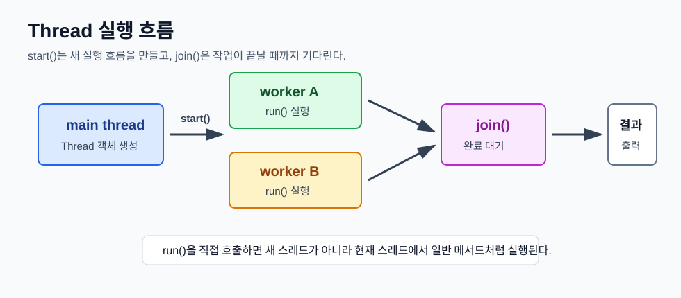
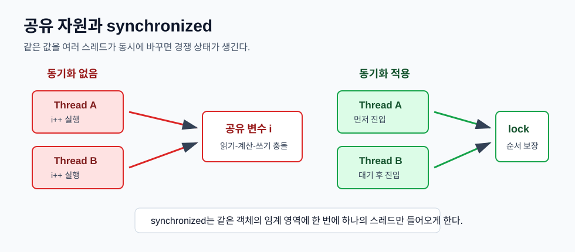

# Day 6. Java Thread, Runnable, join, sleep, synchronized

> 목표: 하나의 프로그램 안에서 여러 작업을 동시에 실행하는 스레드의 흐름을 이해하고, 공유 자원을 안전하게 다루기 위한 `join`, `sleep`, `interrupt`, `synchronized`의 역할을 익힌다.

## 오늘 배운 것 한눈에 보기



오늘의 핵심은 **스레드는 작업을 동시에 실행하게 해주지만, 공유 데이터가 있으면 실행 순서와 동기화를 반드시 고려해야 한다는 것**이다.

| 구분 | 핵심 의미 | lab05 예시 |
| --- | --- | --- |
| `Thread` | 독립적으로 실행되는 작업 흐름 | `CountThread`, `SumThread` |
| `Runnable` | 스레드가 실행할 작업을 객체로 분리 | `PrintTask`, `Deposit`, `Withdraw` |
| `start()` | 새 스레드를 시작하고 `run()`을 실행시킴 | `t1.start()` |
| `run()` | 스레드가 실제로 수행할 코드 | 반복 출력, 합계 계산 |
| `join()` | 다른 스레드가 끝날 때까지 기다림 | `SumThread`, `AccountTest` |
| `sleep()` | 현재 스레드를 잠시 멈춤 | `PrintTask` |
| `interrupt()` | 대기 중인 스레드에 중단 신호 전달 | `Thread.currentThread().interrupt()` |
| `synchronized` | 공유 자원 접근을 한 번에 하나씩 제한 | `Account.deposit`, `Counter.incrementWithSync` |

## 1. Thread는 동시에 실행되는 작업 흐름이다

일반적인 프로그램은 위에서 아래로 한 줄씩 실행된다. 하지만 스레드를 사용하면 여러 작업을 동시에 진행할 수 있다.

`CountThread`는 `Thread`를 상속해서 직접 스레드 클래스를 만든 예제다.

```java
public class CountThread extends Thread {
    private int count;

    public CountThread(String name, int count) {
        super(name);
        this.count = count;
    }

    @Override
    public void run() {
        for (int i = 1; i <= count; i++) {
            System.out.println(getName() + " " + i);
        }
    }
}
```

```java
CountThread t1 = new CountThread("A", 3);
CountThread t2 = new CountThread("B", 3);

t1.start();
t2.start();
```

`start()`를 호출하면 JVM이 새 스레드를 만들고, 그 안에서 `run()`을 실행한다. 출력 순서는 항상 같지 않을 수 있다.

```text
A 1
B 1
A 2
B 2
...
```

스레드는 동시에 실행되기 때문에 어떤 스레드가 먼저 출력될지는 운영체제의 스케줄링에 따라 달라진다.

## 2. start()와 run()은 다르다

스레드를 배울 때 가장 중요한 차이는 `start()`와 `run()`이다.

| 호출 | 의미 |
| --- | --- |
| `thread.start()` | 새 스레드를 만들고 그 스레드에서 `run()` 실행 |
| `thread.run()` | 새 스레드 없이 현재 스레드에서 일반 메서드처럼 실행 |

스레드로 실행하려면 직접 `run()`을 부르는 것이 아니라 `start()`를 호출해야 한다.

```java
thread.start(); // 스레드 시작
```

`run()` 메서드는 개발자가 직접 호출하려고 만드는 것이 아니라, 스레드가 시작되었을 때 실행될 작업을 정의하는 곳이다.

## 3. Runnable은 작업과 스레드를 분리한다

`Thread`를 상속하는 방식도 가능하지만, 실무에서는 `Runnable`로 작업을 분리하는 방식이 자주 쓰인다.

`PrintTask`는 `Runnable`을 구현해서 출력 작업만 따로 만든 예제다.

```java
public class PrintTask implements Runnable {
    private String message;
    private int count;

    @Override
    public void run() {
        while (count-- > 0) {
            System.out.println(message);
            Thread.sleep(100);
        }
    }
}
```

실행할 때는 `Runnable` 객체를 `Thread`에 넣는다.

```java
PrintTask task1 = new PrintTask("티워어어어언", 5);
PrintTask task2 = new PrintTask("제엔쥐이이이", 5);

new Thread(task1).start();
new Thread(task2).start();
```

이 구조는 "작업은 `Runnable`, 실행 흐름은 `Thread`"로 역할을 나눈다.

## 4. sleep()은 현재 스레드를 잠시 멈춘다

`Thread.sleep(100)`은 현재 실행 중인 스레드를 100ms 동안 멈춘다.

```java
try {
    Thread.sleep(100);
} catch (InterruptedException e) {
    Thread.currentThread().interrupt();
}
```

`sleep()`은 `InterruptedException`을 던질 수 있기 때문에 예외 처리가 필요하다.

여기서 `Thread.currentThread().interrupt()`를 다시 호출하는 이유는, 예외를 잡으면서 사라질 수 있는 interrupt 상태를 복구하기 위해서다. 즉 "이 스레드는 중단 요청을 받은 상태"라는 신호를 다시 남겨둔다.

## 5. join()은 계산이 끝날 때까지 기다린다

`SumThread`는 1부터 1,000,000까지 합계를 구하는 예제다.

```java
SumThread thread = new SumThread();

thread.start();
System.out.println("join 전 합계: " + thread.getTotal());
thread.join();
System.out.println("join 후 합계: " + thread.getTotal());
```

`join()`을 호출하기 전에는 스레드가 아직 계산 중일 수 있다. 그래서 `join 전 합계`는 완성된 값이 아닐 수 있다.

반면 `thread.join()` 이후에는 해당 스레드가 끝난 것이 보장된다.

| 시점 | 의미 |
| --- | --- |
| `start()` 직후 | 계산 스레드가 실행 중일 수 있음 |
| `join()` 전 출력 | 중간값이 출력될 수 있음 |
| `join()` 후 출력 | 계산 완료 후 최종값 출력 |

## 6. 공유 자원은 동시에 접근하면 값이 깨질 수 있다



`Counter` 예제는 동기화가 왜 필요한지 보여준다.

```java
public void increment() {
    this.i++;
}
```

`i++`는 한 줄처럼 보이지만 실제로는 대략 세 단계로 나뉜다.

| 단계 | 의미 |
| --- | --- |
| 읽기 | 현재 `i` 값을 읽음 |
| 계산 | `i + 1` 계산 |
| 쓰기 | 계산한 값을 다시 저장 |

두 스레드가 동시에 `i++`를 실행하면 서로 같은 값을 읽고 같은 결과를 저장할 수 있다. 그래서 100,000번씩 두 번 증가시켜도 결과가 200,000보다 작게 나올 수 있다.

```java
Thread t1 = new Thread(() -> {
    for (int i = 0; i < 100000; i++) {
        counter.increment();
    }
});

Thread t2 = new Thread(() -> {
    for (int i = 0; i < 100000; i++) {
        counter.increment();
    }
});
```

이런 문제를 경쟁 상태라고 한다. 여러 스레드가 같은 데이터를 동시에 바꾸면서 실행 결과가 순서에 따라 달라지는 상황이다.

## 7. synchronized는 한 번에 하나의 스레드만 들어오게 한다

`synchronized`를 붙이면 해당 메서드는 같은 객체 기준으로 한 번에 하나의 스레드만 실행할 수 있다.

```java
public synchronized void incrementWithSync() {
    this.j++;
}
```

두 스레드가 동시에 호출해도 한 스레드가 먼저 들어가서 작업을 끝내고, 그 다음 스레드가 들어간다.

| 메서드 | 동기화 여부 | 결과 |
| --- | --- | --- |
| `increment()` | 없음 | 최종값이 기대보다 작을 수 있음 |
| `incrementWithSync()` | 있음 | 최종값 200,000 보장 |

동기화는 정확성을 높이지만, 한 번에 하나씩 처리하므로 무조건 빠른 것은 아니다. 공유 데이터를 안전하게 바꿔야 하는 곳에 선택적으로 사용해야 한다.

## 8. 계좌 예제는 synchronized의 실제 활용이다

`AccountTest`는 하나의 `Account` 객체를 여러 스레드가 함께 사용하는 예제다.

```java
class Account {
    private BigDecimal balance;

    public synchronized void deposit(int amount) {
        balance = balance.add(BigDecimal.valueOf(amount));
    }

    public synchronized void withdraw(int amount) {
        balance = balance.subtract(BigDecimal.valueOf(amount));
    }
}
```

입금과 출금은 잔액이라는 공유 데이터를 변경한다. 그래서 `deposit()`과 `withdraw()`에 `synchronized`를 붙여 한 번에 하나의 스레드만 잔액을 바꾸게 했다.

```java
Account account = new Account(new BigDecimal("10000"));
Thread t1 = new Thread(new Deposit(account));
Thread t2 = new Thread(new Deposit(account));

t1.start();
t2.start();

t1.join();
t2.join();
```

두 입금 스레드가 모두 끝난 뒤 잔액을 확인하려면 `join()`이 필요하다. `join()`이 없으면 입금이 끝나기 전에 잔액을 출력할 수 있다.

## 9. lab05 코드로 정리하기

| 파일 | 학습 포인트 | 핵심 코드 |
| --- | --- | --- |
| `CountThread.java` | `Thread` 상속과 `start()` | `extends Thread`, `run()` |
| `PrintTask.java` | `Runnable`, `sleep`, `interrupt` | `implements Runnable`, `Thread.sleep(100)` |
| `SumThread.java` | `join()`으로 작업 완료 대기 | `thread.join()` |
| `Counter.java` | 경쟁 상태와 동기화 비교 | `increment()`, `synchronized` |
| `AccountTest.java` | 공유 객체를 안전하게 수정 | `deposit`, `withdraw` |

## 오늘의 결론

스레드는 동시에 여러 작업을 처리할 수 있게 해준다. 하지만 여러 스레드가 같은 객체나 변수를 함께 사용하면 값이 예상과 다르게 바뀔 수 있다.

그래서 스레드를 사용할 때는 다음 순서로 생각해야 한다.

1. 어떤 작업을 별도 스레드로 실행할지 정한다.
2. `Thread` 상속 또는 `Runnable` 구현 중 적절한 방식을 선택한다.
3. 작업 시작은 `start()`로 한다.
4. 결과가 필요하면 `join()`으로 끝날 때까지 기다린다.
5. 공유 데이터를 수정한다면 `synchronized`로 보호한다.

`lab05`는 이 흐름을 작은 예제로 나눠서 확인한 실습이다.
