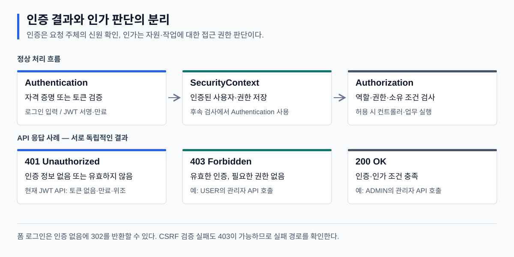
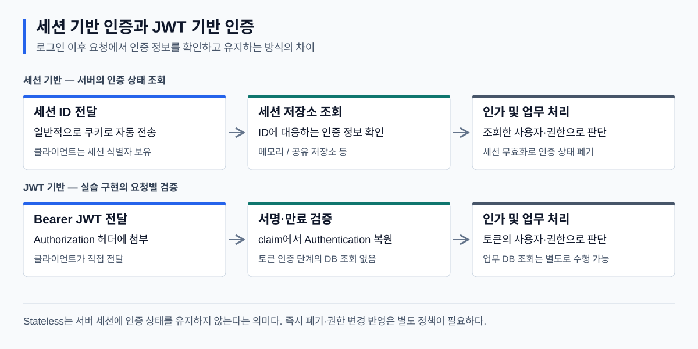

# 웹 보안과 Spring Security 학습 기록

> 목적: 인증·인가의 원리와 웹 보안 위협을 정리하고, 면접에서 동작 과정과 설계상의 선택을 설명할 수 있도록 기록한다.
> 관련 실습: [Spring Security JWT 프로젝트](../springSecurity/README.md). 이 문서는 개념을 중심으로, 프로젝트 README는 실제 구현을 중심으로 정리한다.

## 1. 보안의 목표와 적용 범위

보안의 기본 목표는 **기밀성(Confidentiality), 무결성(Integrity), 가용성(Availability)**을 유지하는 것이다. 이를 CIA라고 한다.

| 목표 | 의미 | 웹 서비스에 적용한 예 |
| --- | --- | --- |
| 기밀성 | 허가된 대상만 정보에 접근 | HTTPS, 개인정보 조회 권한 제한 |
| 무결성 | 정보의 무단 변경을 방지하거나 탐지 | JWT 서명 검증, 데이터 변경 권한 검사 |
| 가용성 | 필요한 시점에 서비스를 이용 | 요청 폭주 제한, 장애 복구, 이중화 |

접근 제어만으로 보안이 완성되지는 않는다. 운영 규정과 계정 관리 같은 **관리적 보안**, 인증·암호화 같은 **기술적 보안**, 장비 출입 통제 같은 **물리적 보안**을 함께 고려해야 한다. 대응 단계도 예방뿐 아니라 탐지·대응·복구까지 포함한다.

실습에서는 인증·인가, 비밀번호 저장, 토큰 검증, 웹 공격 방어를 중점적으로 학습했다.

## 2. 인증과 인가



**인증(Authentication)은 요청 주체의 신원을 확인하는 과정이고, 인가(Authorization)는 해당 주체가 자원에 접근하거나 작업을 수행할 수 있는지 판단하는 과정이다.** 인증 성공은 모든 자원에 대한 접근 허용을 의미하지 않는다.

| 구분 | 판단 대상 | Spring Security의 주요 구성 요소 | 실습 예 |
| --- | --- | --- | --- |
| 인증 | 아이디·비밀번호 또는 토큰이 유효한가 | `AuthenticationManager`, `AuthenticationProvider` | 로그인 입력 검증, JWT 검증 |
| 인가 | 필요한 역할·권한·소유 조건을 만족하는가 | `AuthorizationManager`, 메서드 보안 | ADMIN 검사, 본인 정보 조회 제한 |

### 401·403·302의 차이

- **401 Unauthorized:** 보호된 API를 호출했지만 인증 정보가 없거나 유효하지 않은 경우. 실습에서는 토큰 없음·만료·위조가 해당한다.
- **403 Forbidden:** 인증된 사용자에게 필요한 권한이 없는 경우. 실습에서는 USER의 관리자 API 호출이 해당한다. CSRF 검증 실패도 403이 될 수 있다.
- **302 Found:** 폼 로그인 설정에서 인증이 없는 요청을 로그인 페이지로 리다이렉트하는 경우.

응답은 인증 방식과 실패 처리 설정에 따라 달라진다. 브라우저와 curl이라는 클라이언트 종류만으로 상태 코드를 단정하지 않는다. 원인을 판단할 때는 요청 경로, 토큰, 적용된 필터와 예외 처리기를 함께 확인한다.

**면접 답변:** “인증은 신원을 확인하고, 인가는 해당 사용자의 작업 권한을 판단합니다. 유효한 토큰이 있는 일반 사용자라도 관리자 API에서는 권한 부족으로 거부될 수 있습니다.”

## 3. Spring Security의 요청 처리 구조

Spring Security의 서블릿 지원은 필터를 기반으로 한다. 요청이 컨트롤러에 도달하기 전에 인증·인가와 보안 정책을 적용한다.

```text
HTTP 요청
  → DelegatingFilterProxy
  → FilterChainProxy
  → 요청에 처음 일치하는 SecurityFilterChain 선택
  → 선택된 체인의 보안 필터 실행
  → DispatcherServlet
  → Controller → Service
  → 응답
```

| 구성 요소 | 책임 |
| --- | --- |
| `DelegatingFilterProxy` | 서블릿 컨테이너의 필터 호출을 스프링이 관리하는 필터 빈으로 위임 |
| `FilterChainProxy` | 요청에 적용할 보안 체인을 선택하고 실행 |
| `SecurityFilterChain` | 요청 매칭 조건과 실행할 보안 필터 목록 정의 |
| `SecurityContext` | 현재 인증 정보인 `Authentication` 보관 |
| `SecurityContextHolder` | 현재 실행 흐름에서 SecurityContext에 접근하는 수단 제공 |

여러 체인이 있어도 **처음 일치한 체인 하나만 선택**된다. 체인 선택과 체인 내부의 URL 인가 규칙 선택은 서로 다른 단계다. 체인의 필터 목록은 폼 로그인, JWT, CSRF 등의 설정에 따라 달라진다.

`permitAll()`은 인가 단계에서 접근을 허용하는 설정이다. 보안 필터 자체를 생략하는 설정이 아니므로, 공개 경로에도 CSRF 검사나 커스텀 필터가 적용될 수 있다. 근거: [Spring Security Architecture](https://docs.spring.io/spring-security/reference/servlet/architecture.html).

### SecurityContext와 세션의 관계

SecurityContext는 인증 정보를 담는 객체이고, 세션은 그 정보를 요청 사이에 유지하는 저장 방식 중 하나다. JWT 인증에서도 인가에 사용할 Authentication을 SecurityContext에 넣는다.

기본 `SecurityContextHolder` 전략은 `ThreadLocal`이다. 따라서 별도 스레드에서 실행되는 `@Async` 작업에 현재 인증 정보가 자동으로 전달된다고 가정하면 안 된다. 필요하면 보안 컨텍스트 전파를 구성한다. 요청 종료 후에는 컨텍스트가 정리되어야 스레드 재사용 시 인증 정보가 섞이지 않는다. 근거: [인증 아키텍처](https://docs.spring.io/spring-security/reference/servlet/authentication/architecture.html).

## 4. 사용자 조회와 비밀번호 검증

DB 기반 인증에서는 사용자 조회와 비밀번호 검증의 책임을 구분한다.

```text
인증 요청
  → AuthenticationManager
  → DaoAuthenticationProvider
  → UserDetailsService: 사용자와 저장된 인증 정보 조회
  → PasswordEncoder.matches: 입력 비밀번호 검증
  → 인증된 Authentication 반환
```

`UserDetailsService.loadUserByUsername()`은 사용자 조회 인터페이스다. 직접 비밀번호를 비교하는 역할은 아니다. `DaoAuthenticationProvider`는 조회된 UserDetails와 PasswordEncoder를 이용해 인증한다.

### 비밀번호 저장 원칙

비밀번호는 원문이나 복호화 가능한 형태 대신 **적응형 단방향 해시**로 저장한다. BCrypt는 salt와 비용 계수를 사용해 동일한 비밀번호의 해시가 반복되지 않도록 하고, 대량 추측의 연산 비용을 높인다.

```java
String encoded = passwordEncoder.encode(rawPassword);
boolean matches = passwordEncoder.matches(rawPassword, encoded);
```

같은 원문이라도 `encode()` 결과가 달라질 수 있으므로 재인코딩한 문자열을 `equals()`로 비교하지 않는다. 해시는 추측 공격을 완전히 제거하지 않으며, 비밀번호 정책과 로그인 시도 제한 등도 필요하다.

실습의 `DelegatingPasswordEncoder`는 기본 저장 알고리즘으로 BCrypt를 사용한다. `{bcrypt}`는 검증할 인코더를 선택하는 접두어이고, `{noop}`는 해시하지 않은 값이다. `{noop}` 초기 데이터와 회원가입으로 생성된 BCrypt 데이터를 구분해야 한다. 근거: [Password Storage](https://docs.spring.io/spring-security/reference/features/authentication/password-storage.html).

## 5. URL 인가와 메서드 인가

### Authority와 Role

| 개념 | 의미 | 예 |
| --- | --- | --- |
| Authority | 권한을 표현하는 문자열 | `member:read`, `ROLE_ADMIN` |
| Role | 역할을 권한으로 표현하는 관례 | 기본적으로 `ROLE_` 접두어 사용 |
| `hasRole("ADMIN")` | 기본 접두어를 적용한 역할 검사 | `ROLE_ADMIN` 검사 |
| `hasAuthority("ROLE_ADMIN")` | 명시한 권한 문자열 검사 | `ROLE_ADMIN` 검사 |
| RoleHierarchy | 상위 역할에 하위 역할의 권한을 포함시키는 인가 정책 | `ADMIN > USER` |

### URL 인가

`requestMatchers`는 선언 순서대로 **처음 일치하는 규칙**을 적용한다. 구체적인 경로를 먼저 선언하고, 나머지 요청에 적용할 `anyRequest()`를 마지막에 둔다.

URL 인가는 관리자 API처럼 경로 단위 정책에 적합하다. 다만 “로그인한 사용자만 허용”으로는 다른 사용자의 데이터를 조회하거나 수정하는 문제를 방지할 수 없다.

### 메서드 인가

실습에서는 요청의 회원 ID와 인증된 사용자 ID를 비교해 소유 조건을 검사한다.

```java
@PreAuthorize("#memId == authentication.name or hasRole('ADMIN')")
```

| 설정 | 적용 시점 | 용도 |
| --- | --- | --- |
| `@EnableMethodSecurity` | 설정 단계 | 메서드 보안 활성화 |
| `@PreAuthorize` | 메서드 실행 전 | 역할·소유 조건 검사 후 실행 |
| `@PostAuthorize` | 실행 후, 반환 전 | 반환 객체에 대한 접근 조건 검사 |

`@PostAuthorize`는 이미 수행한 변경 작업을 자동으로 취소하는 기능이 아니다. 수정·삭제의 권한은 실행 전에 검사해야 한다. 기본 프록시 방식에서는 같은 객체 내부의 직접 호출이 프록시를 우회할 수 있으므로 보안 메서드의 호출 경계도 고려한다. 근거: [Method Security](https://docs.spring.io/spring-security/reference/servlet/authorization/method-security.html).

## 6. 세션 기반 인증과 JWT 기반 인증



세션 기반 인증은 서버가 로그인 상태를 저장하고 클라이언트가 전달한 세션 ID로 해당 상태를 찾는다. JWT 기반 인증은 클라이언트가 전달한 토큰을 검증하고 토큰의 claim에서 인증 정보를 복원할 수 있다.

| 비교 항목 | 세션 기반 | JWT 기반, 실습 구현 기준 |
| --- | --- | --- |
| 전달 정보 | 일반적으로 쿠키의 세션 ID | Authorization 헤더의 Bearer 토큰 |
| 인증 정보 확인 | 서버 세션 저장소 조회 | 서명·만료 검증 후 claim에서 복원 |
| 요청 간 상태 | 서버가 인증 상태 유지 | 인증 상태를 서버 세션에 저장하지 않음 |
| 다중 서버 | 공유 세션 저장소 또는 라우팅 정책 필요 | 검증 키와 정책 공유 필요 |
| 무효화 | 서버 세션 삭제로 가능 | 별도 폐기 정책 없이 즉시 무효화하기 어려움 |
| 권한 변경 | 세션의 인증 정보 갱신 필요 | 발급 시점의 권한이 토큰에 남을 수 있음 |
| 주요 비용 | 저장소 관리·조회 | 토큰 크기·검증 연산·폐기 정책 |

세션도 Redis 등으로 공유해 확장할 수 있다. JWT가 항상 더 빠르거나 더 적합한 것은 아니다. 선택할 때는 배포 구조, 강제 로그아웃 요구, 권한 변경 반영 시점, 운영 복잡도를 비교한다.

**Stateless는 인증 상태를 서버 세션으로 유지하지 않는다는 의미다.** 회원·주문 같은 업무 데이터 조회까지 없어진다는 뜻은 아니다. Refresh Token이나 토큰 폐기 목록을 서버에 저장하는 설계도 가능하다. 실습에서도 JWT 인증 복원에는 DB 조회가 없지만 `/api/me`는 회원 정보를 DB에서 조회한다.

## 7. JWT의 구조와 검증 범위

JWT는 claim을 전달하는 형식이며, 서명된 형태(JWS)와 암호화된 형태(JWE)로 표현할 수 있다. 실습에서 사용하는 것은 **HMAC으로 서명한 JWT**다.

```text
Base64URL(Header).Base64URL(Payload).Base64URL(Signature)
```

| 구성 | 역할 |
| --- | --- |
| Header | 서명 알고리즘 등 토큰 처리 정보 |
| Payload | 사용자 식별자, 권한, 발급·만료 시각 등의 claim |
| Signature | Header와 Payload에 대한 위변조 검증값 |

Header와 Payload는 인코딩되었을 뿐 암호화되지 않아 읽을 수 있다. 서명은 무결성과 발급 주체의 검증에 사용하며 기밀성을 제공하지 않는다. 따라서 비밀번호나 불필요한 민감정보를 넣지 않는다.

### 주요 claim

| 이름 | 의미 | 현재 실습 |
| --- | --- | --- |
| `sub` | 토큰의 대상 주체 | 로그인 아이디 `memId` |
| `iat` | 발급 시각 | 발급 순간 |
| `exp` | 만료 시각 | 기본 발급 후 30분 |
| `iss` | 발급자 | 설정하지 않음 |
| `aud` | 토큰의 수신 대상 | 설정하지 않음 |
| `jti` | 토큰 식별자 | 설정하지 않음 |
| `roles` | 애플리케이션에서 정의한 권한 claim | 권한 문자열 |

Registered Claim은 표준에 정의된 이름이다. Public Claim은 충돌 방지를 고려해 등록하거나 이름 공간을 사용하고, Private Claim은 당사자 간 합의한 이름이다. Private Claim이라는 분류가 내용의 비밀성을 의미하지는 않는다. 근거: [RFC 7519](https://www.rfc-editor.org/rfc/rfc7519).

### 인코딩·해시·서명을 구별하기

- **인코딩:** 표현 형식을 변환한다. Base64URL 디코딩으로 내용을 읽을 수 있다.
- **비밀번호 해시:** 원문 복원 없이 입력값과 저장값의 일치 여부를 검증한다.
- **JWT 서명:** 키를 이용해 내용의 위변조와 발급 주체를 검증한다.

HMAC은 공유 비밀키로 서명·검증한다. RSA 같은 비대칭 방식은 개인키로 서명하고 공개키로 검증한다. 실습의 JJWT HMAC 키는 최소 32바이트가 필요하고, 키의 무작위성과 보관도 중요하다. 실제 검증에서는 서비스 정책에 맞춰 허용 알고리즘, 서명, 시간 claim, 발급자·대상 등을 확인한다. 실습은 `iss`·`aud` 기대값 검증을 추가하지 않았다. 근거: [JJWT 0.12.6](https://github.com/jwtk/jjwt/blob/0.12.6/README.adoc).

## 8. 토큰 수명·갱신·폐기

**Access Token**은 보호된 자원에 접근할 때 사용하고, **Refresh Token**은 Access Token을 재발급받을 때 사용한다. 수명은 서비스 요구에 맞춰 정하며 고정된 정답은 없다.

Access Token의 수명을 줄이면 탈취된 토큰이 사용될 수 있는 기간을 줄일 수 있지만, 탈취와 재사용 자체를 막지는 못한다. Refresh Token을 도입한다면 저장·폐기, rotation, 이전 토큰 재사용 탐지 정책을 함께 설계해야 한다. Refresh Token은 반드시 JWT일 필요가 없다.

클라이언트가 토큰을 삭제하는 것과 서버가 토큰을 무효화하는 것은 다르다. 강제 로그아웃이나 즉시 권한 변경이 필요하다면 폐기 목록, 토큰 버전, 사용자 상태 확인 등의 방법을 검토한다.

현재 프로젝트는 Access Token만 구현했고, Refresh Token·재발급·토큰 폐기는 구현하지 않았다. 기본 30분이 지나면 다시 로그인해야 한다.

## 9. 웹 보안 위협과 방어의 구분

| 항목 | 공격 또는 정책의 의미 | 주요 방어·설정 |
| --- | --- | --- |
| XSS | 공격자의 스크립트가 서비스의 사용자 브라우저에서 실행 | 문맥에 맞는 출력 인코딩, 안전한 DOM 처리, CSP |
| CSRF | 브라우저가 자동 첨부하는 인증 정보를 이용한 비의도적 요청 | CSRF 토큰, SameSite, 요청 출처 검증 |
| 클릭재킹 | UI를 겹치거나 위장해 의도하지 않은 클릭 유도 | X-Frame-Options, CSP frame-ancestors |
| CORS | 다른 출처의 스크립트가 응답에 접근할 수 있는지 정하는 브라우저 정책 | 필요한 출처·메서드·헤더만 허용 |

CORS는 인증·인가를 대체하지 않는다. 다른 출처에서 모든 요청을 보내지 못하도록 막는 서버 접근 제어도 아니다. 클릭재킹 방어 헤더와 CSRF 토큰 역시 별개의 기능이다.

수업에서 연결한 취약점은 접근 제어 누락, 평문 비밀번호 저장, 세션 고정, 과도한 CORS 허용, 비밀키·비밀번호 로그 노출, CSRF다. 세션 고정은 공격자가 정한 세션 ID로 피해자의 로그인 상태를 이용하는 문제이며, 로그인 시 세션 ID 변경 등의 보호가 필요하다. 근거: [세션 관리](https://docs.spring.io/spring-security/reference/servlet/authentication/session-management.html).

### 쿠키 속성과 토큰 저장 위치

| 속성 | 역할 | 한계 |
| --- | --- | --- |
| HttpOnly | JavaScript의 쿠키 접근 제한 | 악성 스크립트의 요청 실행이나 CSRF까지 방지하지 않음 |
| Secure | 일반적으로 HTTPS 연결에서 쿠키 전송 | 인증·인가를 대체하지 않음 |
| SameSite | 교차 사이트 요청의 쿠키 전송 제한 | 서비스 흐름에 맞는 설정과 추가 방어 검토 필요 |

HttpOnly 쿠키도 조건에 맞는 요청에는 자동으로 전송된다. HttpOnly가 CSRF 방어라는 설명은 부정확하다. 근거: [MDN Set-Cookie](https://developer.mozilla.org/en-US/docs/Web/HTTP/Reference/Headers/Set-Cookie).

| 저장 방식 | 특징 | 고려할 위험 |
| --- | --- | --- |
| localStorage | 같은 출처에서 공유, 직접 삭제 전까지 유지 | JS 접근이 가능해 XSS로 토큰 탈취 가능 |
| sessionStorage | 보통 탭별로 분리, 탭 세션 동안 유지 | JS 접근에 따른 XSS 위험은 남음 |
| JS 메모리 | 보통 새로고침 시 소실, 직접 헤더에 첨부 | 실행 중 악성 JS의 영향은 남음 |
| 일반 쿠키 | 도메인·경로·만료 등에 따라 자동 전송 | JS 접근과 CSRF 위험 검토 |
| HttpOnly 쿠키 | JS 직접 접근 제한, 요청에 자동 전송 | CSRF 방어와 쿠키 속성 설계 필요 |

**CSRF 보호 여부는 JWT 사용 여부가 아니라 인증 정보의 전달 방식과 공격 조건을 기준으로 판단한다.** 실습은 Bearer 헤더만으로 인증하며 자동 첨부되는 인증 쿠키를 사용하지 않는 전제로 CSRF를 비활성화했다. 쿠키 인증이나 다른 자동 전송 인증을 도입하면 재검토해야 한다. 근거: [CSRF와 Stateless 브라우저 애플리케이션](https://docs.spring.io/spring-security/reference/features/exploits/csrf.html).

## 10. 면접 핵심 질문

| 질문 | 답변에 포함할 내용 | 이어질 수 있는 질문 |
| --- | --- | --- |
| 인증과 인가의 차이는? | 신원 확인과 자원·작업 권한 판단 | 로그인했는데 403이 발생하는 이유 |
| Spring Security는 어디서 동작하나? | 서블릿 필터 체인, 컨트롤러 실행 전 검사 | DelegatingFilterProxy와 FilterChainProxy의 차이 |
| permitAll이면 보안 검사를 생략하나? | 인가만 허용, 다른 필터는 실행 가능 | 회원가입 API에서 CSRF 403이 발생하는 이유 |
| UserDetailsService가 비밀번호를 비교하나? | 사용자 조회 담당, Provider와 Encoder가 인증 수행 | encode 결과를 equals로 비교하면 안 되는 이유 |
| JWT는 암호화된 데이터인가? | 현재 서명 JWT는 인코딩이며 읽을 수 있음 | 서명과 암호화, HMAC과 RSA의 차이 |
| JWT가 세션보다 좋은가? | 확장·무효화·권한 변경·운영 비용 비교 | 즉시 로그아웃 구현 방법 |
| Stateless면 DB 조회가 없는가? | 세션 인증 상태와 업무 데이터 조회를 구분 | /api/me의 DB 접근 이유 |
| URL 권한 검사만으로 충분한가? | 역할 외에 객체 소유 조건도 검사 | 메서드 보안과 프록시 우회 |
| HttpOnly가 XSS·CSRF를 모두 막나? | 쿠키 읽기 제한과 공격 전체 방어를 구분 | 토큰 저장 방식의 장단점 |
| JWT를 쓰면 CSRF를 꺼도 되는가? | 인증 정보 자동 전송 여부가 판단 기준 | 쿠키에 JWT를 넣는 경우 |

### 1분 설명

“Spring Security는 서블릿 필터 체인에서 요청을 검사합니다. 인증 결과는 SecurityContext에 저장되고, 인가는 그 정보로 자원 접근과 작업 권한을 판단합니다. DB 인증에서는 UserDetailsService가 사용자를 조회하고 PasswordEncoder가 비밀번호 검증에 사용됩니다. 실습은 로그인 성공 시 JWT를 발급하고 이후 요청에서 토큰을 검증하는 방식입니다. JWT를 사용하더라도 업무 데이터 조회는 남으며, 발급 후 권한 변경과 즉시 폐기를 위한 정책이 필요합니다. CSRF는 토큰 형식보다 인증 정보가 브라우저에서 자동 전송되는지를 기준으로 검토해야 합니다.”

## 11. 복습 확인

- [ ] 요청의 필터 체인 선택부터 컨트롤러 실행까지 설명할 수 있다.
- [ ] 인증 객체, SecurityContext, 세션의 역할을 구분할 수 있다.
- [ ] 비밀번호 해시와 JWT 서명의 목적을 구별할 수 있다.
- [ ] 세션과 JWT를 무효화·확장·권한 변경 관점에서 비교할 수 있다.
- [ ] Role·Authority·객체 소유 조건의 차이를 설명할 수 있다.
- [ ] XSS·CSRF·클릭재킹·CORS의 방어를 구분할 수 있다.
- [ ] [실습 코드](../springSecurity/README.md)로 401·403, DB 조회, 토큰 만료 사례를 설명할 수 있다.
