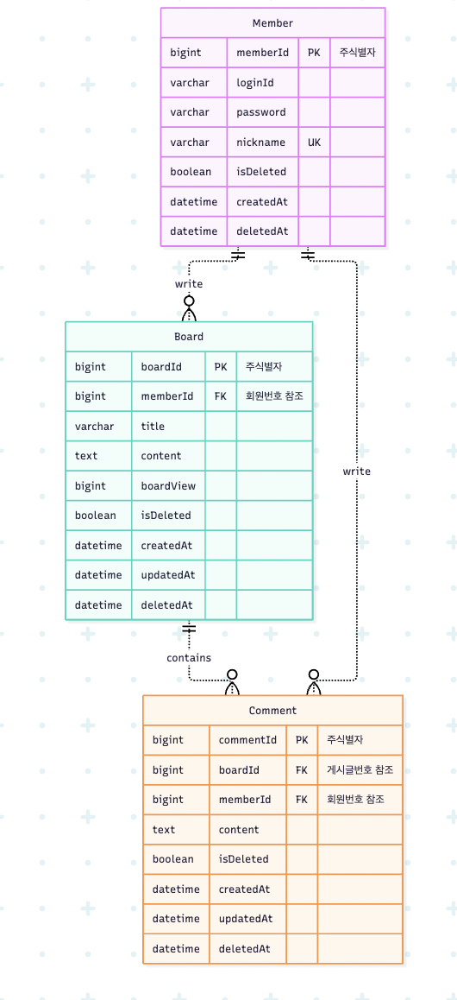

# 논리 ERD

Member (회원) 1 : N Board (게시글)
Member (회원) 1 : N Comment (댓글)
Board (게시글) 1 : N Comment (댓글)

## Member (회원)

| 속성명       | 설명                                        | PK/FK |
| ------------ | ------------------------------------------- | ----- |
| 회원번호     | 회원 식별자                                 | PK    |
| 로그인아이디 | 로그인 시 사용하는 아이디                   |       |
| 비밀번호     | 해시로 저장                                 |       |
| 닉네임       | 형용사+동물(곤충) 조합 자동 생성, 중복 불가 |       |
| 삭제여부     | 소프트 삭제 플래그                          |
| 가입일시     | 회원가입 시각                               |       |
| 삭제일시     | 삭제 처리된 시각                            |

## Board (게시글)

| 속성명     | 설명               | PK/FK       |
| ---------- | ------------------ | ----------- |
| 게시글번호 | 게시글 식별자      | PK          |
| 회원번호   | 작성자             | FK → Member |
| 제목       |                    |             |
| 내용       |                    |             |
| 조회수     |                    |             |
| 삭제여부   | 소프트 삭제 플래그 |             |
| 작성일시   |                    |             |
| 수정일시   |                    |             |
| 삭제일시   | 삭제 처리된 시각   |             |

## Comment (댓글)

| 속성명     | 설명               | PK/FK       |
| ---------- | ------------------ | ----------- |
| 댓글번호   | 댓글 식별자        | PK          |
| 게시글번호 | 소속 게시글        | FK → Board  |
| 회원번호   | 작성자             | FK → Member |
| 내용       |                    |             |
| 삭제여부   | 소프트 삭제 플래그 |             |
| 작성일시   |                    |             |
| 삭제일시   | 삭제 처리된 시각   |             |

# 물리 ERD

