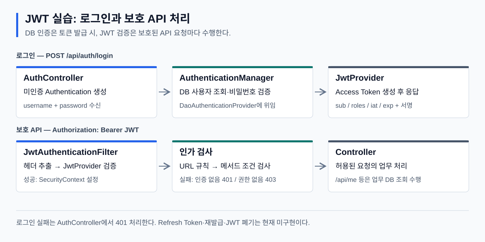
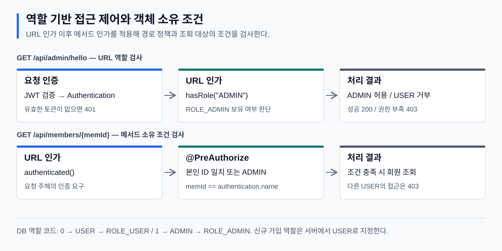

# Spring Security JWT 인증·인가 구현 기록

> 목적: 학습한 구현을 코드 기준으로 기록하고, 면접에서 동작 과정·설정 이유·한계와 개선 방향을 설명한다.
> 개념 정리: [웹 보안과 Spring Security](../daily-log/security.md).
> 문서의 HTTP 응답은 소스에서 예상한 결과다. 실제 실행 검증 결과와 구분한다.

## 1. 구현 범위와 학습 요점

이 프로젝트는 DB의 회원 정보로 로그인 요청을 인증하고, 성공 시 JWT Access Token을 발급한다. 보호된 API에서는 Bearer 토큰을 검증해 인증 정보를 복원하고, URL 규칙과 메서드 보안으로 접근을 제한한다.

현재 활성 설정은 [SecurityConfig](src/main/java/com/example/springsecurity/config/SecurityConfig.java)다. [SecurityConfigV2](src/main/java/com/example/springsecurity/config/SecurityConfigV2.java)는 `@Configuration` 등이 주석 처리된 폼 로그인 비교 예제다.

| 항목 | 현재 구현 |
| --- | --- |
| 빌드 설정 | Spring Boot `4.1.1`, Java `21` |
| 주요 의존성 | Spring Security, Web MVC, JPA, Validation, MySQL |
| JWT 라이브러리 | JJWT `0.12.6` |
| 로그인 요청 | `POST /api/auth/login`, JSON 아이디·비밀번호 |
| 인증 정보 전달 | `Authorization: Bearer <JWT>` |
| Access Token 수명 | 기본 `1800000ms`, 30분 |
| 비밀번호 저장 | DelegatingPasswordEncoder, 회원가입 시 BCrypt |
| 세션 정책 | `SessionCreationPolicy.STATELESS` |
| 접근 제어 | URL 인가 + `@PreAuthorize` |
| 역할 계층 | `ADMIN > USER` |
| 미구현 기능 | Refresh Token, 재발급 API, JWT 폐기·로그아웃 API, 프론트 토큰 저장 |

버전은 [build.gradle](build.gradle)의 선언값이다. 의존성 해결과 실행 가능 여부를 검증했다는 의미는 아니다. 실제 패키지 이름은 `memeber`이며 파일 링크에도 해당 이름을 사용한다.

학습의 핵심은 다음 세 가지다.

1. **인증 책임 분리:** 사용자 조회, 비밀번호 검증, 토큰 발급, 요청별 검증을 각각 구분한다.
2. **인가 조건 분리:** 인증 여부, 관리자 역할, 조회 대상의 소유 조건을 별도로 검사한다.
3. **Stateless의 범위:** 서버 세션에 인증 상태를 유지하지 않아도 SecurityContext와 업무 데이터 조회는 필요하다.

## 2. 주요 클래스와 책임

| 영역 | 클래스 | 책임 |
| --- | --- | --- |
| 보안 정책 | [SecurityConfig](src/main/java/com/example/springsecurity/config/SecurityConfig.java) | 필터 체인, URL 인가, 실패 처리, 인증 매니저·인코더·역할 계층 구성 |
| 회원가입 | [MemberController](src/main/java/com/example/springsecurity/memeber/controller/MemberController.java) | 입력 수신과 Bean Validation |
| 회원가입 | [MemberService](src/main/java/com/example/springsecurity/memeber/service/MemberService.java) | 중복 확인, 비밀번호 해시, USER 회원 저장 |
| DB 인증 | [CustomUserDetailsService](src/main/java/com/example/springsecurity/memeber/service/CustomUserDetailsService.java) | 회원 조회 후 UserDetails로 변환 |
| 로그인 API | [AuthController](src/main/java/com/example/springsecurity/auth/AuthController.java) | 인증 요청, 토큰 응답, 현재 회원 조회, 로그인 실패 처리 |
| JWT | [JwtProvider](src/main/java/com/example/springsecurity/auth/JwtProvider.java) | 토큰 발급·검증과 Authentication 복원 |
| 요청 인증 | [JwtAuthenticationFilter](src/main/java/com/example/springsecurity/auth/JwtAuthenticationFilter.java) | 헤더 추출, JWT 검증 호출, SecurityContext 설정 |
| 메서드 인가 | [MemberApiController](src/main/java/com/example/springsecurity/memeber/controller/MemberApiController.java) | 관리자 목록 조회, 본인 또는 관리자 상세 조회 |
| 보호 API | [AdminController](src/main/java/com/example/springsecurity/api/AdminController.java), [HelloController](src/main/java/com/example/springsecurity/api/HelloController.java) | 인증·역할 검사 후 응답 |
| 영속성 | [MemberRepository](src/main/java/com/example/springsecurity/memeber/repository/MemberRepository.java) | 회원 조회·저장·아이디 존재 확인 |
| 역할 변환 | [MemberCodeConverter](src/main/java/com/example/springsecurity/converter/MemberCodeConverter.java) | DB 코드와 Java enum 변환 |
| API 오류 | [GlobalExceptionHandler](src/main/java/com/example/springsecurity/exception/GlobalExceptionHandler.java) | 입력 검증 오류와 IllegalArgumentException 처리 |

`JwtProvider`는 이름과 달리 Spring Security의 `AuthenticationProvider` 구현체가 아니다. 이 프로젝트에서 JWT 생성·검증을 담당하도록 만든 컴포넌트다.

## 3. 회원가입: 입력 검증과 인증 정보 저장

```text
POST /signup
  → MemberController: @Valid 입력 검증
  → MemberService: existsByMemId()로 중복 확인
  → PasswordEncoder.encode()로 비밀번호 해시
  → Member 생성: MemberCode.USER 지정
  → MemberRepository.save()
  → 201 Created, {"memId":"park"}
```

요청 예시는 다음과 같다. 비밀번호 `1234`는 실습용이며 운영 정책을 의미하지 않는다.

```json
{"memId":"park","memNm":"박지성","password":"1234"}
```

회원가입은 인증 없이 허용하지만, 입력 검증과 역할 결정은 서버에서 수행한다. DTO에는 역할 필드가 없고 Member 생성자는 USER를 지정하므로 클라이언트가 가입 요청으로 관리자 역할을 선택할 수 없다.

`memId`·`memNm`에는 `@NotBlank`, 비밀번호에는 `@Size(min = 4)`가 있다. `@Size`는 null을 거부하지 않으므로 현재 비밀번호 필수 검증은 불충분하다. 사전 중복 조회도 동시 요청의 충돌을 완전히 방지하지 못하므로 DB 제약과 예외 처리를 최종 기준으로 삼아야 한다.

## 4. 로그인: DB 인증 후 JWT 발급



### 인증 요청 흐름

```text
POST /api/auth/login
  → AuthController.login()
  → UsernamePasswordAuthenticationToken(username, password): 인증 전
  → AuthenticationManager.authenticate()
  → DaoAuthenticationProvider를 통한 DB 인증
  → CustomUserDetailsService.loadUserByUsername()
  → MemberRepository.findByMemId(): DB 회원 조회
  → UserDetails 반환: 아이디·저장 비밀번호·권한
  → PasswordEncoder.matches(): 입력 비밀번호 검증
  → 인증된 Authentication 반환
  → JwtProvider.createAccessToken()
  → {"accessToken":"..."}
```

```java
Authentication auth = authenticationManager.authenticate(
        new UsernamePasswordAuthenticationToken(req.username(), req.password()));
return new TokenResponse(jwtProvider.createAccessToken(auth));
```

인자 두 개짜리 토큰은 미인증 상태의 입력 정보를 담는다. `AuthenticationManager`는 인증을 적절한 Provider에 위임한다. 프로젝트는 UserDetailsService와 PasswordEncoder 빈을 제공하고, `AuthenticationConfiguration`을 통해 인증 매니저를 컨트롤러에 주입한다.

CustomUserDetailsService는 회원 정보를 조회해 UserDetails로 변환한다. 비밀번호 비교는 이 서비스가 직접 수행하지 않고 Provider가 PasswordEncoder를 이용해 처리한다. 로그인 필드 `username`은 표시 이름 `mem_nm`이 아니라 로그인 식별자 `mem_id`에 대응한다.

### 역할 코드 변환

```text
DB mem_cd '0'
  → MemberCodeConverter → MemberCode.USER
  → getRole().name() → "USER"
  → User.builder().roles("USER") → "ROLE_USER"
  → Authentication의 GrantedAuthority
  → JWT의 roles claim
```

`'1'`은 ADMIN을 거쳐 `ROLE_ADMIN`이 된다. `.roles()`는 기본 접두어를 추가하므로 `ROLE_`를 중복해서 전달하지 않는다.

### 로그인 실패 경로

아이디 없음·비밀번호 불일치로 발생한 AuthenticationException은 **AuthController의 `@ExceptionHandler`**가 처리한다. 응답은 401과 공통 메시지이며, 어느 입력이 틀렸는지 구분해서 공개하지 않는다.

```json
{"message":"아이디 또는 비밀번호가 올바르지 않습니다."}
```

이 경로는 보호된 API의 인증 없음에 사용하는 `authenticationEntryPoint`와 다르다.

## 5. JWT 발급과 검증

### 발급 데이터

| 항목 | 생성 코드 | 의미 |
| --- | --- | --- |
| `sub` | `.subject(auth.getName())` | 로그인 아이디 |
| `roles` | `.claim("roles", roles)` | 권한을 쉼표로 연결한 문자열 |
| `iat` | `.issuedAt(now)` | 발급 시각 |
| `exp` | `.expiration(...)` | 만료 시각 |
| 서명 | `.signWith(key)` | 공유 비밀키를 이용한 HMAC 서명 |

권한이 하나인 일반 회원은 `roles`에 `ROLE_USER`를 담는다. Java에서는 Date와 밀리초 수명을 사용하지만, JWT 시간 claim은 초 단위 NumericDate로 표현된다.

### 검증 후 인증 객체 복원

```java
Claims claims = Jwts.parser().verifyWith(key).build()
        .parseSignedClaims(token)
        .getPayload();
```

이 과정은 단순 디코딩과 다르다. 서명과 만료 등을 검증하며, 형식 오류·서명 불일치·만료는 JwtException 계열 예외로 이어진다. 현재는 발급자 `iss`와 수신 대상 `aud`의 기대값 검증을 별도로 설정하지 않았다.

검증 후에는 roles claim을 SimpleGrantedAuthority 목록으로 변환하고 인증된 객체를 만든다.

```java
new UsernamePasswordAuthenticationToken(
        claims.getSubject(), null, authorities);
```

권한을 받는 인자 세 개짜리 생성자는 인증 완료 상태를 나타낸다. 이 객체는 **신뢰할 수 있는 검증이 끝난 뒤에만 생성**해야 한다. 비밀번호는 더 이상 필요하지 않아 credentials 자리에 null을 사용한다.

### 서명과 키 관리

실습의 JWT는 서명된 토큰이므로 Payload는 읽을 수 있다. 서명은 위변조를 검증하며 내용을 숨기지 않는다.

키는 설정 문자열을 UTF-8 바이트로 변환해 `Keys.hmacShaKeyFor()`에 전달한다. HMAC 키는 최소 32바이트가 필요하며, `signWith(key)`는 키 길이에 맞는 알고리즘을 선택한다. 따라서 고정된 HS256 지정 코드가 있다고 설명하면 안 된다. 키 길이뿐 아니라 무작위성과 안전한 주입·보관도 필요하다. 근거: [JJWT 0.12.6](https://github.com/jwtk/jjwt/blob/0.12.6/README.adoc).

## 6. 요청별 JWT 인증과 SecurityContext

```text
Authorization 헤더 확인
  ├─ Bearer 접두어 없음 → 인증 정보 추가 없이 진행
  └─ Bearer 접두어 있음 → JWT 추출·검증
       ├─ 성공 → SecurityContext에 Authentication 설정
       └─ 실패 → SecurityContext 비우기
  → chain.doFilter()
  → URL 인가 검사
  → 허용되면 컨트롤러 실행 및 메서드 보안 적용
```

| 처리 | 구현 의도 |
| --- | --- |
| `getHeader(HttpHeaders.AUTHORIZATION)` | 헤더 기반 인증 정보 수신 |
| `startsWith("Bearer ")` | 현재 코드가 처리하는 접두어 확인 |
| `substring(BEARER_PREFIX.length())` | 토큰 문자열 추출 |
| `setAuthentication(auth)` | 후속 인가와 컨트롤러에 인증 정보 제공 |
| `catch (JwtException \| IllegalArgumentException)` | 유효하지 않은 토큰의 인증 정보 제거 |
| `chain.doFilter(...)` | 다음 필터·서블릿으로 처리 위임 |

필터는 토큰 검증 실패 시 직접 401을 반환하지 않는다. 미인증 상태로 진행시키고, 접근 허용 여부는 인가 규칙이 결정한다. 보호된 경로는 401이 예상되지만, 공개 로그인 경로는 이후 로그인 검증을 진행할 수 있다.

세션을 사용하지 않더라도 **현재 요청의 인증 결과를 SecurityContext에 설정해야 한다.** 후속 권한 검사와 컨트롤러의 Authentication 파라미터가 이 정보를 사용한다.

필터는 OncePerRequestFilter를 상속한다. 디스패치와 already-filtered 표식을 통해 중복 실행을 제어하며, async·error 디스패치는 별도 정책을 가진다. 전체 요청 생애에서 무조건 한 번만 실행된다고 단정하지 않는다. 근거: [OncePerRequestFilter API](https://docs.spring.io/spring-framework/docs/current/javadoc-api/org/springframework/web/filter/OncePerRequestFilter.html).

현재 필터는 `@Component` 없이 설정에서 직접 생성한다. 필터 빈을 사용하면 Boot의 서블릿 자동 등록과 보안 체인 등록이 겹칠 수 있으므로 등록 경로를 관리해야 한다.

## 7. 보안 설정의 근거와 적용 범위

| 설정 | 적용 이유·효과 | 설명할 때의 주의점 |
| --- | --- | --- |
| `csrf.disable()` | Bearer 헤더 인증만 사용하는 실습 전제 | JWT·Stateless 자체가 CSRF 비활성화의 근거는 아님 |
| `STATELESS` | 세션 생성·조회로 인증 상태를 유지하지 않음 | 다른 애플리케이션 코드의 세션 생성까지 금지하지는 않음 |
| `formLogin.disable()` | JSON 로그인 API 사용 | 기본 로그인 화면 사용 안 함 |
| `httpBasic.disable()` | 보호 API의 인증 방식을 JWT로 구성 | Basic 인증을 함께 사용하지 않음 |
| `permitAll()` | 로그인·회원가입·오류 경로 공개 | JWT 필터와 입력 검증은 계속 적용 가능 |
| `hasRole("ADMIN")` | 관리자 API 접근 제한 | 인증 성공과 관리자 권한은 별개 |
| `anyRequest().authenticated()` | 나머지 경로에 인증 요구 | 구체적인 규칙 뒤에 선언 |
| `addFilterBefore(...)` | 인가 전에 JWT 인증 정보를 설정 | 기준 필터 위치 지정이 폼 로그인 활성화를 의미하지 않음 |
| `@EnableMethodSecurity` | 객체 소유 조건 등 세부 접근 제어 | 프록시 호출 경계 고려 |

JWT 필터는 UsernamePasswordAuthenticationFilter의 기준 위치 앞에 배치한다. 필요한 것은 폼 로그인 자체가 아니라 인가 전에 인증 정보가 준비되는 순서다. 근거: [Spring Security Architecture](https://docs.spring.io/spring-security/reference/servlet/architecture.html).

STATELESS는 Spring Security의 인증 세션 정책이다. 따라서 모든 응답에서 JSESSIONID가 절대로 생성되지 않는다고 단정하지 않는다. 근거: [세션 관리](https://docs.spring.io/spring-security/reference/servlet/authentication/session-management.html).

### CSRF와 CORS

현재 구현은 브라우저가 인증 쿠키를 자동 첨부하지 않고 클라이언트가 Bearer 헤더를 직접 전달하는 전제다. 인증 정보를 쿠키로 받거나 다른 자동 전송 인증을 추가하면 CSRF 방어를 재검토해야 한다. 근거: [CSRF](https://docs.spring.io/spring-security/reference/features/exploits/csrf.html).

별도의 CORS 허용 설정은 없다. 다른 출처의 프론트와 연동한다면 실제 출처, 메서드, Authorization 헤더, preflight 처리에 맞춰 설정해야 한다. 프론트 프레임워크의 사용 여부만으로 세션과 JWT 중 하나가 필수인 것은 아니다.

## 8. URL 인가와 객체 소유 조건



| API | URL 조건 | 메서드 조건 | 허용 대상 |
| --- | --- | --- | --- |
| `POST /signup` | 공개 | 없음 | 입력 검증을 통과한 요청 |
| `POST /api/auth/login` | 공개 | 없음 | 로그인 검증을 통과한 요청에 토큰 발급 |
| `GET /api/hello` | 인증 필요 | 없음 | 유효한 토큰 소지자 |
| `GET /api/me` | 인증 필요 | 없음 | 유효한 토큰 소지자, 회원 DB 조회 수행 |
| `GET /api/admin/hello` | ADMIN 필요 | 없음 | 관리자 |
| `GET /api/members` | 인증 필요 | ADMIN 필요 | 관리자 |
| `GET /api/members/{memId}` | 인증 필요 | 본인 또는 ADMIN | 해당 사용자 또는 관리자 |

실제 경로는 `/api/hello`와 `/api/me`다. `/api/auth/**` 공개 규칙은 해당 경로의 인가를 허용할 뿐, 매핑이 없는 API를 생성하지 않는다.

회원 상세 조회는 다음 조건으로 타인 정보 접근을 제한한다.

```java
@PreAuthorize("#memId == authentication.name or hasRole('ADMIN')")
```

`authentication.name`은 JWT의 sub에서 복원한 로그인 아이디다. kim의 토큰으로 kim 조회는 허용되고 lee 조회는 거부되며, ADMIN은 두 회원을 모두 조회할 수 있다. 기본 프록시 방식의 메서드 보안이 적용되어야 하므로 같은 객체 내부 직접 호출은 별도로 고려한다. 근거: [Method Security](https://docs.spring.io/spring-security/reference/servlet/authorization/method-security.html).

RoleHierarchy의 `ADMIN > USER`는 인가에서 상위 역할에 하위 역할의 권한을 포함시킨다. JWT의 roles claim이나 Authentication의 원래 권한 목록을 자동으로 변경하는 기능은 아니므로 ADMIN 토큰에는 `ROLE_ADMIN`만 보일 수 있다.

## 9. 예외 처리와 HTTP 응답

| 발생 지점·상황 | 처리 경로 | 예상 응답 |
| --- | --- | --- |
| 보호 API에 토큰 없음·만료·위조 | 미인증 상태 → 인가 거부 → authenticationEntryPoint | 401 |
| 로그인 아이디 없음·비밀번호 불일치 | AuthController의 AuthenticationException 처리기 | 401 JSON |
| USER의 관리자 API·타인 회원 조회 | 인가 거부 → accessDeniedHandler | 403 |
| 회원가입 Bean Validation 실패 | GlobalExceptionHandler.invalid() | 400 JSON |
| 가입 아이디 중복 | IllegalArgumentException → duplicate() | 409 JSON |

필터 단계와 MVC 컨트롤러 단계는 예외 처리 경로가 다르다. 보안 설정의 sendError 응답과 컨트롤러의 ResponseEntity JSON 응답은 본문 형식도 같다고 보장되지 않는다.

전역 처리기에서 모든 Exception을 동일하게 변환하면 보안 예외의 처리를 방해할 수 있다. 현재도 IllegalArgumentException 전체를 409로 처리해 중복 이외 오류까지 같은 응답이 될 수 있으며, `orElseThrow()`로 끝나는 회원 미존재 상황은 명시적 404 처리가 없다.

## 10. 폼 로그인 설정과의 비교

비활성 SecurityConfigV2는 폼 로그인과 세션 인증을 비교하기 위한 예제다.

| 단계 | 폼 로그인 예제 | 현재 JWT 구현 |
| --- | --- | --- |
| 입력 수신 | UsernamePasswordAuthenticationFilter | AuthController |
| 신원 확인 | AuthenticationManager, 사용자 조회·비밀번호 검증 | 동일한 DB 인증 구성 사용 |
| 인증 결과 유지 | 일반적인 폼 설정에서 세션에 저장 | JWT를 응답하고 매 요청에서 인증 복원 |
| 이후 전달 정보 | 보통 세션 쿠키 | Bearer 헤더 |
| CSRF | 기본 보호, /signup만 예외 | 현재 전제에서 비활성화 |

인증 정보를 받는 경로와 요청 사이의 상태 유지 방식은 달라도 사용자 조회·비밀번호 검증 부품은 공유할 수 있다.

폼 예제의 `/signup` CSRF 예외는 실습 설정이다. `permitAll()`과 CSRF 예외는 다른 설정이며, 기본 폼 로그인에서는 POST 로그아웃과 CSRF 토큰을 함께 사용한다. 클릭재킹 방어 헤더도 CSRF와 별개다.

두 설정을 비교 실행하려면 빈 이름 충돌을 피하고, 폼 예제의 성공 URL `/hello`에 대한 컨트롤러를 준비하거나 경로를 수정해야 한다. 현재 활성 상태를 기준으로 JWT 구현을 설명한다.

## 11. 재현 절차와 검증 시나리오

### 실행 환경

1. Java 21과 프로젝트의 Gradle wrapper를 사용한다.
2. [application.yml](src/main/resources/application.yml)의 MySQL 접속 대상은 기본 `localhost:3310/shinhan_carrer_next`다. 본인 환경에 맞는 DB와 사용자 권한을 준비한다.
3. `db_password`와 `JWT_SECRET` 환경변수를 설정한다. 실제 값은 문서나 Git에 기록하지 않는다. JWT 키는 충분한 무작위성을 가진 32바이트 이상의 값으로 준비한다.
4. JPA가 `ddl-auto: none`이므로 테이블을 사전에 준비한다. [test.sql](test.sql)은 **기존 tb_mem을 DROP하고 다시 만든다.** 폐기 가능한 실습 DB에서만 내용을 확인하고 사용한다.
5. 프로젝트 폴더에서 `./gradlew bootRun`으로 실행한다. 아래 예시는 기본 서버 포트 8080을 가정한다.

SQL의 `kim / 1234`는 USER, `lee / 1234`는 ADMIN이다. 두 초기 계정의 `{noop}1234`는 평문 실습 데이터다. 회원가입으로 저장한 계정은 BCrypt 형식이다.

### API 요청 예시

```bash
# 일반 사용자 로그인: 응답의 accessToken을 복사한다.
curl -i -X POST http://localhost:8080/api/auth/login \
  -H 'Content-Type: application/json' \
  -d '{"username":"kim","password":"1234"}'

# 복사한 토큰으로 인사 API 호출
curl -i http://localhost:8080/api/hello \
  -H 'Authorization: Bearer <kim의 accessToken>'

# 본인 정보 조회
curl -i http://localhost:8080/api/me \
  -H 'Authorization: Bearer <kim의 accessToken>'

# kim은 다른 회원 lee를 조회할 수 없다.
curl -i http://localhost:8080/api/members/lee \
  -H 'Authorization: Bearer <kim의 accessToken>'

# 관리자 로그인 후 받은 토큰으로 관리자 API 호출
curl -i http://localhost:8080/api/admin/hello \
  -H 'Authorization: Bearer <lee의 accessToken>'
```

`<...>`는 실제 발급받은 토큰으로 바꾼다. lee 토큰은 로그인 요청의 `username`을 `lee`로 바꿔 받는다.

| 실험 | 예상 결과 | 확인할 개념 |
| --- | --- | --- |
| 토큰 없이 `/api/hello` | 401 | 인증 필요 |
| 잘못된 비밀번호로 로그인 | 401 | 컨트롤러의 인증 실패 처리 |
| 유효한 kim 토큰으로 `/api/hello` | 200 | JWT 인증 성공 |
| 유효한 kim 토큰으로 `/api/admin/hello` | 403 | USER의 관리자 권한 부족 |
| 유효한 lee 토큰으로 `/api/admin/hello` | 200 | 관리자 인가 |
| 유효한 kim 토큰으로 `/api/members/kim` | 200 | 본인 조회 |
| 유효한 kim 토큰으로 `/api/members/lee` | 403 | 타인 조회 거부 |
| 유효한 kim 토큰으로 `/api/members` | 403 | 메서드의 관리자 검사 |
| 만료된 토큰으로 `/api/hello` | 401 | 만료 검사 |
| Payload를 바꾸고 원래 서명으로 `/api/hello` | 401 | 서명 검증 |
| 공개 `/signup`에 잘못된 입력 | 400, 일반적인 검증 위반 | 공개여도 입력 검사는 수행 |

이 표의 회원 조회 성공은 SQL의 해당 회원이 존재한다는 전제다. 상태뿐 아니라 응답과 로그도 함께 확인한다. 만료 실습은 개발 설정의 `access-expiration-ms`를 잠시 짧게 바꾼 뒤 **새 토큰을 발급**해 확인하고 복원한다. 설정 변경이 기존 토큰의 exp를 바꾸지는 않는다.

### 인증 복원과 업무 조회의 구분

`JwtProvider.getAuthentication()`에는 DB 호출이 없다. 하지만 `/api/me`와 회원 API에는 `MemberRepository` 호출이 있다. 토큰을 검사하는 단계와 업무 데이터를 가져오는 단계를 구분해서 설명한다.

## 12. 구현 한계와 개선 방향

소스에서 확인한 한계와 개선 방향을 정리한다. 현재 구현된 동작과 향후 설계할 기능을 구분해 설명한다.

| 현재 구현 | 문제·제약 | 개선 방향 |
| --- | --- | --- |
| 로그인 DTO 전체와 저장 비밀번호를 로그에 출력 | 평문 입력 비밀번호와 해시가 로그에 남을 수 있음 | `AuthController`의 요청 로그, 사용자 조회 서비스의 비밀번호 로그 제거·마스킹 |
| JWT_SECRET에 개발용 기본값 존재 | 기본값으로 배포하면 알려진 키를 사용할 위험 | 운영 환경에서 별도 비밀키 주입을 필수로 관리 |
| Access Token만 발급 | 만료 후 다시 로그인, 탈취 토큰 즉시 폐기 어려움 | 필요에 따라 Refresh Token, rotation, 폐기 정책 구현 |
| 토큰 권한만으로 인가 | 역할 변경·회원 삭제가 기존 토큰에 즉시 반영되지 않음 | 짧은 수명, 상태 조회·토큰 버전·폐기 목록 등 서비스에 맞는 정책 |
| `JpaRepository<Member, Long>` | Member의 `@Id`는 String | 저장소 ID 제네릭을 String으로 맞추기 |
| Signup 비밀번호에 `@Size`만 적용 | null은 Size 제약으로 거부되지 않음 | `@NotBlank`와 길이 정책 함께 적용 |
| 로그인 DTO에 입력 검증 없음 | 잘못된 입력의 응답이 일관되지 않을 수 있음 | DTO 제약과 `@Valid`, 인증 실패 응답 정책 정리 |
| 중복을 `existsByMemId()`로 먼저 검사 | 동시 가입이 모두 사전 검사를 통과할 수 있음 | DB PK 제약을 최종 기준으로 삼고 충돌 예외 응답 처리 |
| `findByMemId(...).orElseThrow()` | 미존재를 명확한 404로 변환하지 않음 | 도메인 예외와 404 처리 |
| 모든 IllegalArgumentException을 409 처리 | 입력·구성 오류도 중복으로 오해할 수 있음 | 중복 회원 전용 예외로 처리 범위 축소 |
| 보안 오류는 sendError, 일부 API 오류는 JSON | 클라이언트가 오류를 다르게 해석해야 함 | API 오류 응답 형식 통일 |
| 별도 CORS 설정 없음 | 다른 출처의 프론트 요청에 추가 설정 필요 | 실제 프론트 출처와 Bearer 헤더에 맞춰 설정 |

Refresh Token·즉시 폐기는 추가 설계 항목이다. 면접에서는 구현 근거를 제시하고, 개선안은 해결하려는 문제와 비용까지 연결해 설명한다.

## 13. 프로젝트 기반 면접 답변

### Q1. 프로젝트의 로그인 흐름을 설명해 주세요.

“AuthController가 JSON 아이디·비밀번호로 인증 전 토큰을 만들고 AuthenticationManager에 전달합니다. DB 인증 과정에서 CustomUserDetailsService가 회원을 조회하고 PasswordEncoder로 비밀번호를 확인합니다. 성공하면 JwtProvider가 사용자 아이디와 권한을 담은 Access Token을 발급합니다.”

### Q2. 로그인 이후에는 어떻게 인증하나요?

“JwtAuthenticationFilter가 Bearer 헤더의 JWT를 검증합니다. 유효한 토큰에서 인증 객체를 복원해 SecurityContext에 넣고, 이후 URL 인가와 메서드 인가가 이 정보를 사용합니다. 서버 세션으로 로그인 상태를 유지하지 않습니다.”

### Q3. 왜 토큰 필터를 인가 필터보다 먼저 둡니까?

“권한 검사 전에 사용자가 누구인지와 어떤 권한이 있는지 알아야 하기 때문입니다. 현재 설정은 UsernamePasswordAuthenticationFilter의 기준 위치 앞에 JWT 필터를 추가합니다.”

### Q4. 토큰이 틀리면 필터가 바로 401을 주나요?

“아닙니다. 인증 정보를 비우고 다음 필터로 넘깁니다. 보호된 URL이면 인가 단계에서 거부해 EntryPoint가 401을 만들고, 공개 URL이면 계속 진행합니다.”

### Q5. 비밀번호가 틀릴 때도 EntryPoint가 처리하나요?

“이 프로젝트의 로그인 실패는 AuthController의 AuthenticationException 처리기가 401 JSON을 반환합니다. 보호된 API의 인증 없음과 처리 경로가 다릅니다.”

### Q6. JWT 사용으로 DB 조회가 없어졌나요?

“JWT 인증 복원 단계는 DB를 조회하지 않습니다. 하지만 /api/me는 회원 이름 등을 조회하므로 DB 접근이 있습니다. 인증 조회와 업무 조회를 구분해야 합니다.”

### Q7. 사용자가 자기 권한을 ADMIN으로 바꾸면 어떻게 되나요?

“Payload를 읽거나 고칠 수는 있지만 정상 서명을 새로 만들 수 없다면 검증에서 거부됩니다. 따라서 비밀키 보호가 중요합니다. 가입할 때도 역할은 서버에서 USER로 지정합니다.”

### Q8. 관리자가 DB에서 강등되면 바로 권한이 사라지나요?

“현재 JWT에는 발급 시점의 권한이 들어 있고 매번 DB 권한을 조회하지 않으므로, 기존 토큰에 이전 권한이 남을 수 있습니다. 즉시 반영하려면 상태 확인이나 폐기·버전 정책이 필요합니다.”

### Q9. 본인 정보 접근은 어떻게 제한했나요?

“URL에서는 로그인을 요구하고, 회원 조회 메서드의 PreAuthorize에서는 요청 memId와 authentication.name이 같은지 또는 ADMIN인지 검사합니다.”

### Q10. 세션과 JWT 중 무엇이 더 좋나요?

“서비스 조건에 따라 선택합니다. 세션은 서버에서 로그인 상태를 폐기하기 쉽고 공유 저장소 설계가 필요합니다. JWT는 토큰으로 인증 정보를 전달하지만 발급 후 폐기와 권한 변경을 별도로 설계해야 합니다.”

### Q11. 가장 먼저 개선하고 싶은 부분은 무엇인가요?

“로그인 입력 비밀번호와 저장 해시가 로그에 남는 부분을 제거하고, 운영 비밀키 주입을 필수로 관리하겠습니다. 이어서 저장소 ID 타입과 입력 검증을 맞추고, 서비스 요구에 따라 토큰 갱신·폐기 정책을 추가하겠습니다.”

## 14. 설명 역량 점검

- [ ] 회원가입: 중복 확인 → 비밀번호 해시 → USER로 저장.
- [ ] 로그인: DB 사용자 조회 → 비밀번호 검증 → JWT 발급.
- [ ] 이후 요청: Bearer 헤더 → JWT 검증 → SecurityContext → 인가 → 컨트롤러.
- [ ] 401과 403, 로그인 실패 처리기와 EntryPoint의 차이를 설명한다.
- [ ] DB 코드 `0/1`, Java 역할 `USER/ADMIN`, 권한 `ROLE_USER/ROLE_ADMIN`을 연결한다.
- [ ] `/api/members/{memId}`에서 URL 검사와 본인 검사를 구별한다.
- [ ] JWT 내용은 읽을 수 있고, 지금 Refresh Token과 즉시 폐기는 없다고 말한다.
- [ ] 내 코드의 개선점 하나를 근거와 함께 설명한다.
